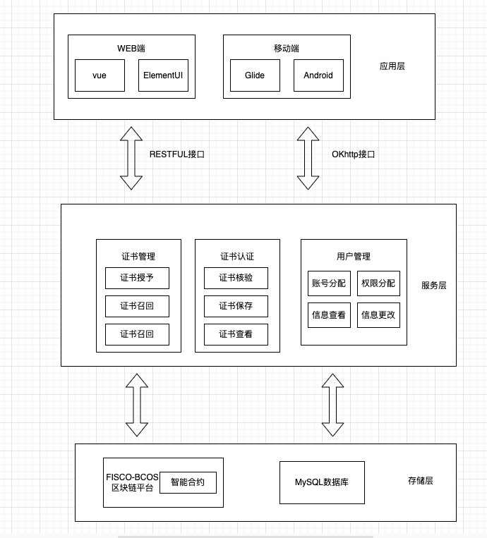

# 1 引言

近年来，随着我国对教育行业的高度重视，高校毕业生逐年递增，社会竞争也逐渐增大，学历造假、 认证造假频繁出现，成为一个全球日益普遍的现象，对社会产生了巨大的负面影响。

而现有的学位管理 系统大都基于中心化的数据管理方式，主要存在以下四个弊端：

- 数据由中央控制，权限过于集中，可能存在私自篡改数据的现象，从而导致数据不可信；
- 数据存储于中心服务器中，存在单点故障或易被不法分子恶意攻击的风险，造成数据完整性的问题；
- 随着高等院校学生人数的增加，数据库建设成本和数据安全风险将会进一步加大；
- 数据存储缺乏公开透明的高效约束机制以及可追溯性，难以保证数据的客观真实性。

FISCO-BCOS作为去中心化的网络，为上述问题提供了新的技术支持。本文通过FISCO-BCOS区块链实现数据的分布式存储，保障学位信息的安全性、防篡改性以及可追溯性，同时通过智能合约技术，无需第三方可信 中心参与即可实现业务交易的安全交互，最终实现公开透明、高效可靠、去中心化的学位认证管理系统。

# 2 系统需求

本系统旨在利用FISCO-BCOS区块链技术为学位证书提供存证性证明，借助智能合约和链上数据的不可篡改性、防伪可追溯特性，确保学位信息的安全存储和学位认证的高度可靠。


### 2.1 服务对象

1. **管理员：** 管理审核机构用户账号和权限的分配。
2. **审核机构用户：** 各大高校，负责证书授予、证书召回和证书查询。
3. **普通用户：** 学生用户和企业用户等，需要证书认证服务的用户。

### 2.2 功能模块

#### 2.2.1. 用户管理功能模块

**目标：** 管理员实现对审核机构用户相关信息的统一管理，审核机构用户账号无需注册，由管理员指定。

- 账号分配：管理员分配审核机构用户账号，为高校用户创建访问权限。
- 权限分配：管理员为审核机构用户分配不同权限，例如证书授予、证书召回等。
- 信息查看：管理员可以查看审核机构用户的相关信息和权限设置。
- 信息更改：管理员可以更改审核机构用户的相关信息和权限。

#### 2.2.2. 证书管理功能模块

**目标：** 面向审核机构用户，如高校，实现证书的授予、召回和查询。

- 证书授予：审核机构用户通过录入学生的学位信息，将学位证书信息上链，确保证书的真实性和防伪性。
- 证书召回：如果学位证书授予错误或不符合要求，审核机构用户可以选择召回证书，并填写召回理由，召回记录被记录在区块链上。
- 证书查询：审核机构用户可以通过系统快速查询学位证书，找到特定学生的证书信息。

#### 2.2.3. 证书认证功能模块

**目标：** 面向普通用户，如学生、企业等，实现证书的核验、查看和保存。

- 证书核验：普通用户输入学位证书信息，系统进行核验。已授予学位且无召回记录，核验结果为真；反之，为假。
- 证书查看：核验为真的证书，用户可以选择查看详细证书信息。
- 证书保存：用户可以保存核验通过的证书，以便日后查阅和使用。

# 3 技术实现

## 3.1 系统架构设计

系统以FISCO-BCOS作为区块链平台，通过WEB端和APP端来和用户实现交互。本系统分为应用层，服务层和存储层三层。



**应用层**

应用层提供 Web 端和移动端两大端口，通过人性化的交互界面面向各类用户。Web 端面向所有用户群体，主要通过 VUE 框架和 Elenment UI 框架进行搭建。移动端仅面向普通用户，基于 Android 平台和 Glide 框架进行开发。

**服务层**

服务层实现了本系统的业务逻辑，包含了智能合约和非智能合约两个部分，实现了应用层和服务层的连接与交互。 系统业务逻辑的智能合约实现包括证书管理合约和证书认证合约。智能合约编译部署完成后，即可与FISCO-BCOS作为区块链平台交互，系统业务逻辑的非智能合约实现包括用户管理功能的实现。通过 JAVA 语言进行业务逻辑编码，以 JSON 形式与存储层中的 MySQL 数据库进行数据交换。

**存储层**

本系统采用FISCO-BCOS区块链平台和数据库两种存储引擎，两者各有优缺点。区块链上的数据具有不可篡改且防伪可溯源的特性，能够作为学位认证的依据。但通过发送交易的方式在链上存储数据是需要代价的，出于系统成本考虑，仅把最重要的数据上链存储。本系统将学位证书信息存储在FISCO-BCOS区块链平台上。MySQL 作为传统的数据库，具有操作简单和访问高效的特点，但其中心化的数据库容易出现单点故障的问题，存在较高的安全隐患。本系统将学位证书上的证件照存储于 MySQL 数据库中，在提高安全性的同时，大大提高了证件照的读取速率。

## 3.2 合约架构设计

1. **证书管理合约：** 包括证书的授予、召回和查询等功能。这个合约由审核机构用户（如高校）使用，用于学位证书信息的上链和管理。
2. **证书认证合约：** 提供证书核验、查看和保存等功能，面向普通用户，如学生和企业。这个合约允许用户验证证书的真实性。

## 3.3 **数据模型定义**

**证书数据模型：** 在证书管理合约中，定义一个结构来存储证书信息。这可能包括证书ID、学生姓名、学位类型、颁发机构等。

```
struct Certificate {
    uint certificateId;
    string studentName;
    string degreeType;
    string issuingInstitution;
    // 其他证书信息字段
}

mapping(uint => Certificate) public certificates; // 以证书ID为键，存储证书信息

```

**验记录数据模型：** 在证书认证合约中，可以定义一个结构来存储核验记录，以便普通用户查询核验历史。

```
struct VerificationRecord {
    address verifier;
    uint certificateId;
    bool isValid;
    uint verificationTime;
}

mapping(address => mapping(uint => VerificationRecord)) public verificationRecords; // 以用户地址和证书ID为键，存储核验记录

```

## 3.4 合约代码实现

### 3.4.1 证书管理合约

设计思路：

- **结构定义：** 定义一个`Certificate`结构，用于存储证书信息，如证书ID、学生姓名、学位类型和颁发机构。
- **数据存储：** 使用`mapping`来存储证书ID和对应的证书信息，这将允许快速查询和验证证书。
- **函数设计：** 创建函数来实现证书授予和证书召回。授予函数应当在链上记录证书信息，召回函数应当删除对应的证书信息。
- **事件定义：** 在证书授予和召回时，使用事件通知外部应用，以便监听状态变化。

代码示例：

```
pragma solidity ^0.8.0;

contract CertificateManager {
    struct Certificate {
        uint certificateId;
        string studentName;
        string degreeType;
        string issuingInstitution;
        // Other certificate info fields
    }
    
    mapping(uint => Certificate) public certificates;

    event CertificateGranted(uint indexed certificateId, string studentName, string degreeType, string issuingInstitution);
    event CertificateRecalled(uint indexed certificateId, string reason);

    function grantCertificate(uint _certificateId, string memory _studentName, string memory _degreeType, string memory _issuingInstitution) public {
        // Check permissions: only authorized institution
        
        certificates[_certificateId] = Certificate({
            certificateId: _certificateId,
            studentName: _studentName,
            degreeType: _degreeType,
            issuingInstitution: _issuingInstitution
            // Initialize other certificate info fields
        });

        emit CertificateGranted(_certificateId, _studentName, _degreeType, _issuingInstitution);
    }

    function recallCertificate(uint _certificateId, string memory _reason) public {
        // Check permissions: only authorized institution

        delete certificates[_certificateId];

        emit CertificateRecalled(_certificateId, _reason);
    }

    // Other methods for managing certificates, like querying, updating, etc.
}

```

### 3.4.2 证书认证合约

**设计思路：**

- **结构定义：** 定义一个`VerificationRecord`结构，用于存储核验记录，包括核验者地址、证书ID、核验结果和时间戳。
- **数据存储：** 使用嵌套的`mapping`来存储核验者地址和证书ID与核验记录之间的关系。
- **函数设计：** 设计函数用于验证证书。这些函数应当创建新的核验记录，并在链上记录核验者的操作。
- **事件定义：** 在核验时触发事件，通知外部应用核验结果和核验者。

**代码实现：**

```
pragma solidity ^0.8.0;

contract CertificateVerifier {
    struct VerificationRecord {
        address verifier;
        uint certificateId;
        bool isValid;
        uint verificationTime;
    }
    
    mapping(address => mapping(uint => VerificationRecord)) public verificationRecords;

    event CertificateVerified(address indexed verifier, uint indexed certificateId, bool isValid, uint verificationTime);

    function verifyCertificate(uint _certificateId, bool _isValid) public {
        // Anyone can verify a certificate

        verificationRecords[msg.sender][_certificateId] = VerificationRecord({
            verifier: msg.sender,
            certificateId: _certificateId,
            isValid: _isValid,
            verificationTime: block.timestamp
        });

        emit CertificateVerified(msg.sender, _certificateId, _isValid, block.timestamp);
    }

    // Other methods for querying verification records, events, etc.
}

```

