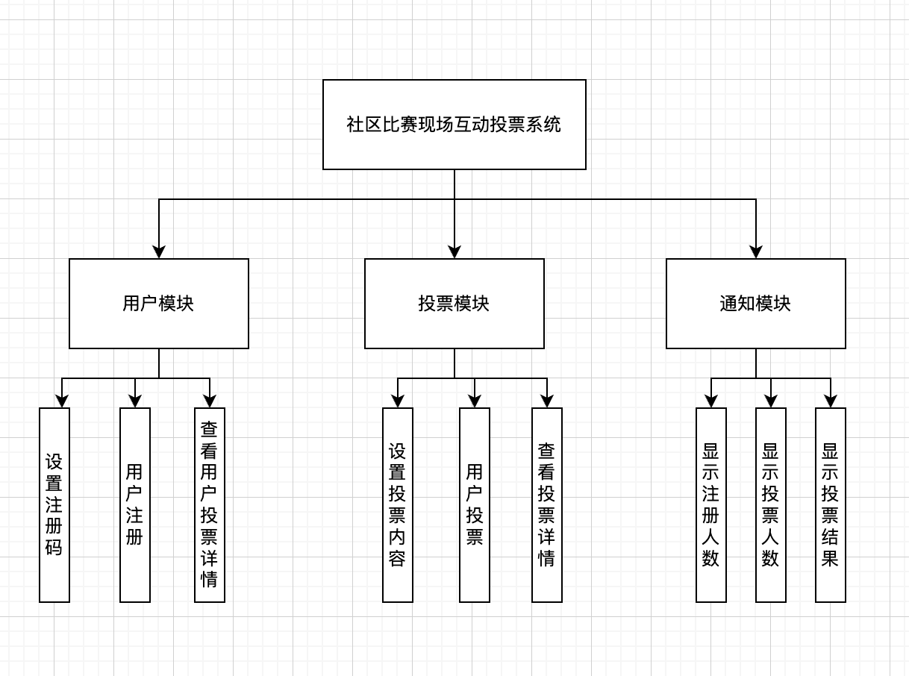
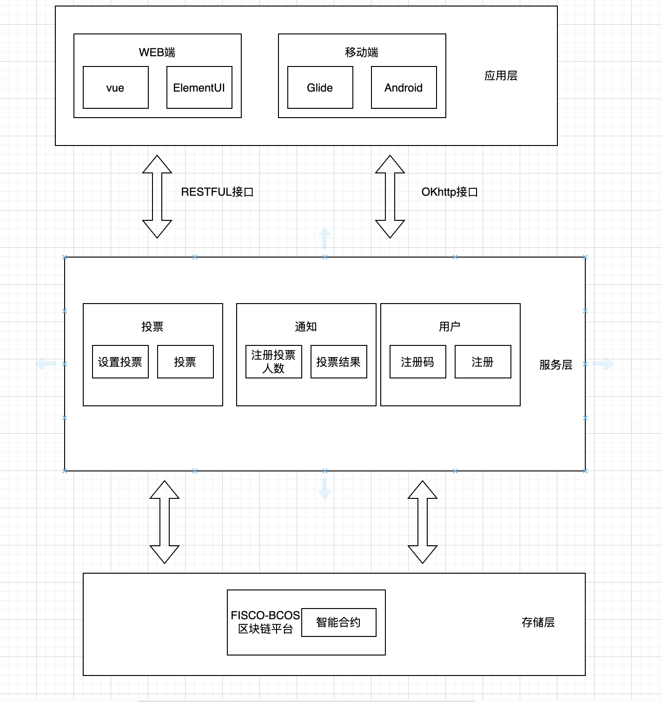

# 基于区块链社区比赛现场互动投票系统

## 1 引言

社区内线下通常会进行非常多的比赛，诸如绘画，舞蹈，唱歌或演讲等比赛，一般线下的做法有两种：

- 一个是主持人喊话投票，下面人举手投票：

  - 这个不利于保护投票人的隐私，同时投票结果也会出现偏差。

- 另外一个则是传统投票系统来进行投票：

  - 这就要求传统投票系统需要相对较高的信任机制，不然容易出现人为干预和舞弊的风险。
  - 人们也容易利用到系统漏洞或购买水军来进行刷票，一定程度上影响了投票的公平性。

  基于区块链社区比赛现场互动投票系统是去中心化的，选中了参与者，参与者可以直接参与投票，而无需依赖单一的中央机构。并且系统上提供了更高的透明度和防篡改性。每个投票操作都会被记录在区块链上，公开可见，难以篡改，从而增加了投票过程的可信度。同时也可以实现匿名投票，保护投票者的隐私。


## 2 系统需求

该系统可以分为两个角色和职责分别是：

- 管理员
  - 负责设置比赛内容，投票选项和注册码
  - 负责设置注册开始时间和截止时间
  - 设置投票开始时间和截止时间
- 投票人
  - 用户注册成为符合资格的投票人
  - 用户参与投票

该系统应该阶段性公布系统投票注册人数以及投票人数，最后显示投票结果。





系统分为三个模块：

- 用户模块：
  - 在用户模块中，管理员可以设置注册码，用户可以根据注册码进行注册，同时用户也可以查看自己参与的投票以及自己的投票选项。
- 投票模块：
  - 在投票模块中，管理员可以设置投票内容，并且用户可以参与投票，投票详情公开显示。
- 通知模块：
  - 在通知模块中，可以显示用户注册人数以及投票参与人数，投票结束后显示投票结果。

## 3 技术实现

### 3.1 系统架构设计

系统以FISCO-BCOS作为区块链平台，通过WEB端和APP端来和用户实现交互。本系统分为应用层，服务层和存储层三层。



### 3.2 合约架构设计

1. **用户合约：**用于管理用户的注册、验证和信息。
2. **投票合约**：管理比赛选手信息、投票流程和记录。
3. **投票工厂合约：**用于创建投票。

### 3.3 数据模型定义

**1. 用户合约的数据模型：**

```solidity
contract UserContract {
    address public admin;
    mapping(address => bytes32) public encryptedRegistrationCodes;
    mapping(address => bool) public registeredUsers;
    
    constructor() {
        admin = msg.sender;
    }
}
```

在这个合约中，数据模型包括：

- `admin`: 存储管理员的地址。
- `encryptedRegistrationCodes`: 将用户地址映射到加密的注册码（`bytes32`类型）。管理员可以设置这些加密的注册码。
- `registeredUsers`: 将用户地址映射到布尔值，表示用户是否已注册。

**2. 投票合约的数据模型：**

```solidity
contract VotingContract {
    address public admin;
    address public userContractAddress;
    uint public startTime;
    uint public endTime;
    string public voteContent;
    string[] public options;
    mapping(address => bool) public hasVoted;
    mapping(string => uint) public optionVotes;
    
    constructor(address _userContractAddress, uint _startTime, uint _endTime, string memory _voteContent, string[] memory _options) {
        admin = msg.sender;
        userContractAddress = _userContractAddress;
        startTime = _startTime;
        endTime = _endTime;
        voteContent = _voteContent;
        options = _options;
    }
}
```

在这个合约中，数据模型包括：

- `admin`: 存储管理员的地址。
- `userContractAddress`: 存储用户合约的地址，以便进行用户注册状态的验证。
- `startTime` 和 `endTime`: 存储投票的开始和结束时间。
- `voteContent`: 存储投票的内容。
- `options`: 存储投票选项的数组。
- `hasVoted`: 将用户地址映射到布尔值，表示用户是否已投票。
- `optionVotes`: 将投票选项映射到获得的票数。

**3. 投票工厂合约的数据模型：**

```solidity
contract VotingFactory {
    address public admin;
    address[] public deployedVotingContracts;

    constructor() {
        admin = msg.sender;
    }
}
```

在这个合约中，数据模型包括：

- `admin`: 存储管理员的地址。
- `deployedVotingContracts`: 存储已部署的投票合约的地址数组。

### 3.4 合约代码实现

**3.4.1. 用户合约：**

设计思路：

用户合约用于管理用户的注册和验证。管理员可以设置加密的注册码，用户通过输入正确的解密后的注册码来进行注册。注册需要在指定的时间范围内进行。

1. **管理员权限和功能：**
   - 设定管理员地址，只有管理员可以管理用户合约。
   - 设置加密的注册码，将用户地址与加密的注册码进行映射。
2. **用户注册流程：**
   - 用户在注册时间内提交注册请求，并提供解密后的注册码。
   - 合约检查用户提供的注册码是否与加密的注册码匹配，如果匹配则用户注册成功。

代码实现：

```solidity
pragma solidity ^0.8.0;

contract UserContract {
    address public admin;
    mapping(address => bytes32) public encryptedRegistrationCodes;
    mapping(address => bool) public registeredUsers;

    modifier onlyAdmin() {
        require(msg.sender == admin, "Only admin can call this function");
        _;
    }

    constructor() {
        admin = msg.sender;
    }

    function setRegistrationCode(address user, bytes32 encryptedCode) public onlyAdmin {
        encryptedRegistrationCodes[user] = encryptedCode;
    }

    function register(bytes32 registrationCode) public {
        require(block.timestamp >= startTime && block.timestamp <= endTime, "Registration not allowed now");
        require(keccak256(abi.encodePacked(registrationCode)) == encryptedRegistrationCodes[msg.sender], "Invalid registration code");
        registeredUsers[msg.sender] = true;
    }
}
```

**3.4.2. 投票合约：**

设计思路：

投票合约用于创建和管理投票活动。管理员可以设置投票的开始和结束时间，投票选项等。只有注册用户才能参与投票。

1. **管理员权限和功能：**
   - 设定管理员地址，只有管理员可以管理投票合约。
   - 创建投票：指定投票开始和结束时间、投票选项等。
2. **投票流程：**
   - 只有注册用户可以参与投票。
   - 用户在投票时间内可以投票，每个用户只能投一次。
   - 投票选项的票数会被记录，用于计算最终结果。

代码实现：

```solidity
pragma solidity ^0.8.0;

contract VotingContract {
    address public admin;
    address public userContractAddress;
    uint public startTime;
    uint public endTime;
    string public voteContent;
    string[] public options;
    mapping(address => bool) public hasVoted;
    mapping(string => uint) public optionVotes;

    constructor(address _userContractAddress, uint _startTime, uint _endTime, string memory _voteContent, string[] memory _options) {
        admin = msg.sender;
        userContractAddress = _userContractAddress;
        startTime = _startTime;
        endTime = _endTime;
        voteContent = _voteContent;
        options = _options;
    }

    modifier onlyAdmin() {
        require(msg.sender == admin, "Only admin can call this function");
        _;
    }

    modifier onlyRegisteredUser() {
        require(isUserRegistered(msg.sender), "Only registered users can participate");
        _;
    }

    function isUserRegistered(address user) internal view returns (bool) {
        (bool success, bytes memory data) = userContractAddress.staticcall(abi.encodeWithSignature("registeredUsers(address)", user));
        if (success) {
            return abi.decode(data, (bool));
        } else {
            revert("Failed to check user registration");
        }
    }

    function vote(string memory option) public onlyRegisteredUser {
        require(block.timestamp >= startTime && block.timestamp <= endTime, "Voting not allowed now");
        require(!hasVoted[msg.sender], "You have already voted");
        require(optionVotes[option] != 0, "Invalid option");
        
        hasVoted[msg.sender] = true;
        optionVotes[option]++;
    }
}
```

**3.4.3 投票工厂合约：**

设计思路：

投票工厂合约用于管理投票合约的创建和部署。

1. **管理员权限和功能：**
   - 设定管理员地址，只有管理员可以管理投票工厂合约。
   - 创建投票：管理员可以调用工厂合约来创建新的投票合约。
2. **投票合约的创建：**
   - 管理员可以通过调用工厂合约创建新的投票合约。
   - 创建投票合约时，传入用户合约地址、投票的开始和结束时间、投票内容和选项。

代码实现：

```solidity
pragma solidity ^0.8.0;

import "./VotingContract.sol";

contract VotingFactory {
    address public admin;
    address[] public deployedVotingContracts;

    constructor() {
        admin = msg.sender;
    }

    modifier onlyAdmin() {
        require(msg.sender == admin, "Only admin can call this function");
        _;
    }

    function createVotingContract(address userContractAddress, uint startTime, uint endTime, string memory voteContent, string[] memory options) public onlyAdmin {
        address newVotingContract = address(new VotingContract(userContractAddress, startTime, endTime, voteContent, options));
        deployedVotingContracts.push(newVotingContract);
    }

    function getDeployedVotingContracts() public view returns (address[] memory) {
        return deployedVotingContracts;
    }
}
```
