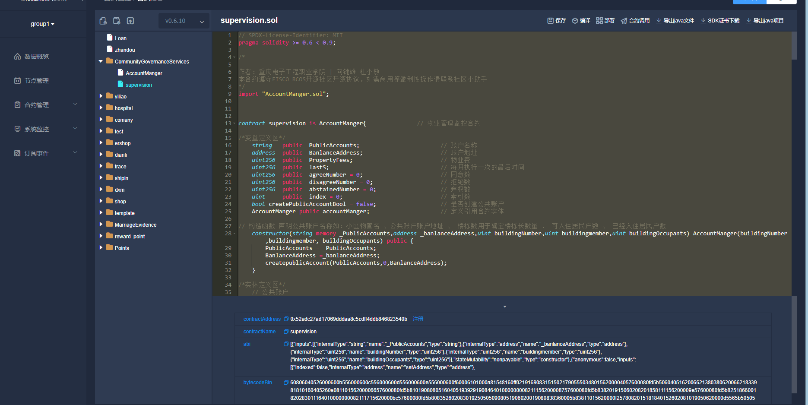
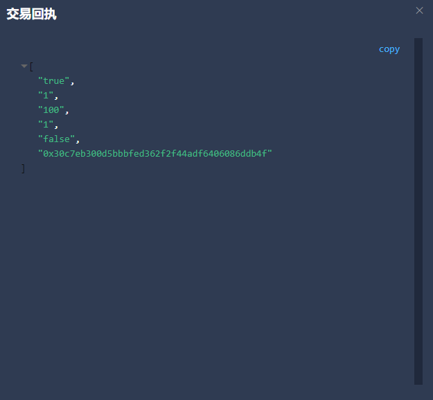
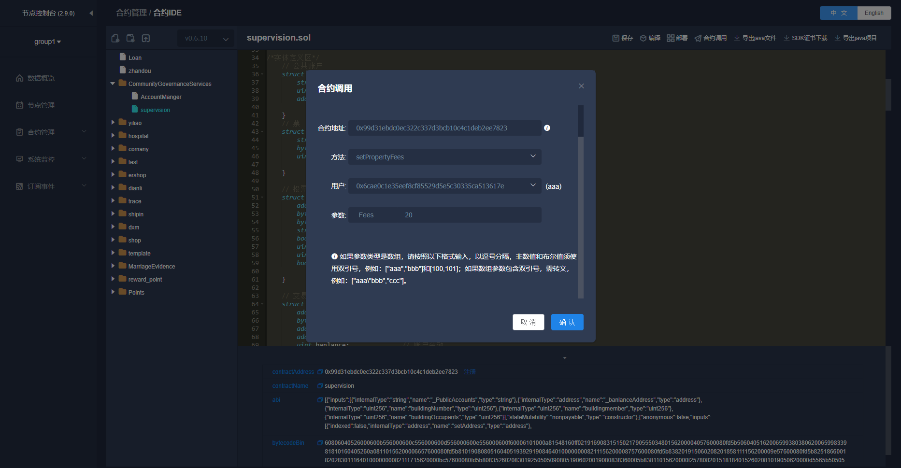

# task47公共服务领域：西安新小区业主自立业主委员会年底分红83万以及103万事件区块链资金透明监管与投票解决方案的尝试

作者 重庆电子工程职业学院 | 向键雄 杜小敏

## 前言

本项目想法来源于，西安新小区业主开出物业自立业主委员会年底分红83万以及103万事件，对于此类事件，我们刨除全员互信的前提下，可以使用区块链代替信任机制，让每一笔交易，每一笔支出收入，都通过所有的居民同意、拒绝、弃权等

## 解决思路

项目基于FISCO BCOS联盟链底层，采用多节点，使用console所带的get_account.sh证书，生成布局节点所需的证书，加入联盟链当中

### 环境

Ubuntu20
FISCO BCOS 2.8
WeBASE-Front 1.5.4

### AccountManger.sol

本合约用于掌控小区居民的增删查改

这里是实体定义区，用于存储居民实体
```
/*实体定义区*/

    // 居民结构体
    struct   ResidentStruct{
        bool checkInBool;                   // 居民是否入住
        string  id;                         // id索引值
        uint banlance;                      // 账户余额用于提交物业管理费的积分
        string  blongsBuilding;             // 所属楼栋 
        bool isBuilding;                    // 是否为楼栋长
        address residentAddress;            // 居民用户地址
    }

    // 监管账户结构体
    struct  RegulatoryAccounts{
        string id;                          // id索引
        uint banlance;                      // 账户余额
    }

```

### PropertySupervision.sol

本合约用于资金监控，透明监管，与投票
这里是实体定义区，用于投票和交易实体

```

/*实体定义区*/
    // 公共账户
    struct PublicAccountStruct {
        string id;                  // id 索引
        uint256 banlance;           // 账户积分
        address banlanceAddress;    // 账户地址

    }
    // 票
    struct VoteStruct {
        string  id;                    // 居民id
        bytes32  voteHash;              // 投票hash
        uint    voteNumber;            // 投票数1同意,2拒绝,3弃权
        
    }

    // 投票请求
    struct VoteRequire {
        address voteRequirer;           // 投票请求者
        bytes32 TranscationHash;        // 交易hash  
        bytes32  voteHash;               // 投票hash
        string  notes;                  // 投票备注
        bool    isVoteAbstainedBool;    // 是否允许弃权
        uint    time;                   // 发起时间
        uint    endTime;                // 截止时间
        bool    bigEvent;               // 是否为大事件

    }

    // 交易历史
    struct TranscationHistory {
        address voteRequirer;           // 投票请求者        
        bytes32 TranscationHash;     // 交易hash
        address from;               // 来自那里
        address to;                 // 去往哪里
        uint banlance;              // 账户余额
        uint time;                  // 交易时间
        bool isBuy;                 // 买
        bool isSell;                // 卖
        string notes;               // 备注
        bool isVoteEffective;       // 交易是否生效
        

    }

```


## 操作

部署时需要根据各小区的不同而初始化不同的居民人数、楼栋长人数、已经入住人数

每一笔资金支出需要投票，当事件标注为大事件时，如：将小区公共区域租售给第三方，需要全员进行投票。当事件标注为小事件时，如：更换小区必须消耗品等，楼长可以代表一栋楼进行投票

每个月会定期发给楼长一定的积分，积分可以用于缴纳物业费，购买物业商品等操作

我们可以查到每一笔收入支出详情，以下为方法总览

## 方法总览

### AccountManger.sol

```
/*功能方法区*/

    // 添加新的居民账户
    function addResident () public returns () {
 
    }
    // 查看居民账户
    function getResident () public view returns () {

    }
    // 修改居民信息
    function ModifyResident () public returns (){

    }
    // 删除居民信息
    function DeleteResident () public view returns () {

    }

    // 将用户设置为楼栋长
    function setBuilding() public returns () {

    }

}
```

### PropertySupervision.sol

```
/*功能方法区*/

    // 缴纳物业费
    function payPropertyFees()public returns() {

    }

    // 投票功能
    function vote() public {

    }

    // 一票肯定
    function oneVote() public {

    }

    // 投票是否成功
    function voteIsAgree() public returns(){
   
    }

    
    // 发起一个投票
    function voteSend() public returns(){


    }

    // 获取voteHash
    function getVoteHash() public view returns() {

    } 


    // 获得投票内容
    function getVote() public view returns() {

    }


    // 新增交易记录
    function SetTransactionRegulation() public {
   
    }


    // 查看公共账户资金
    function getAccountsFounds() public view returns(uint256,address) {

    }


    // 创建初始公共账户,只允许创建一次
    function createpublicAccount() public {

}

```


## 部署效果图



