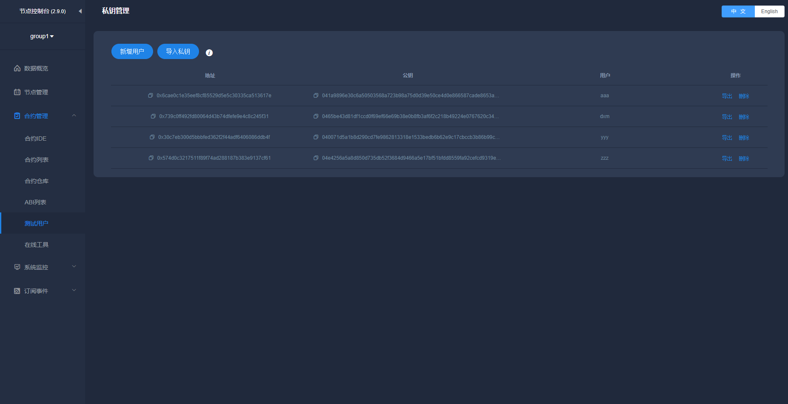
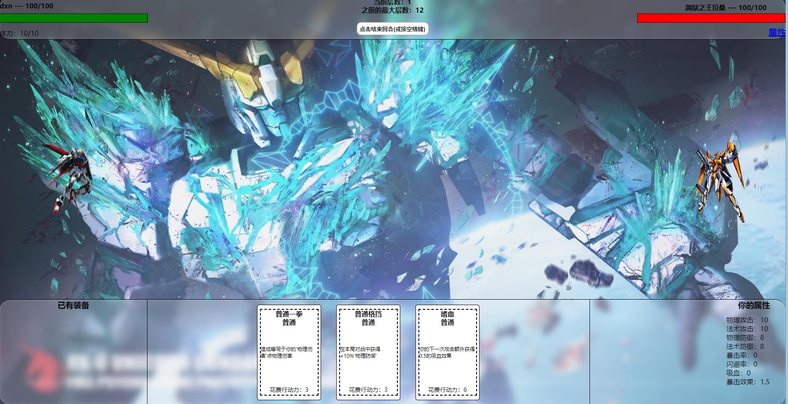
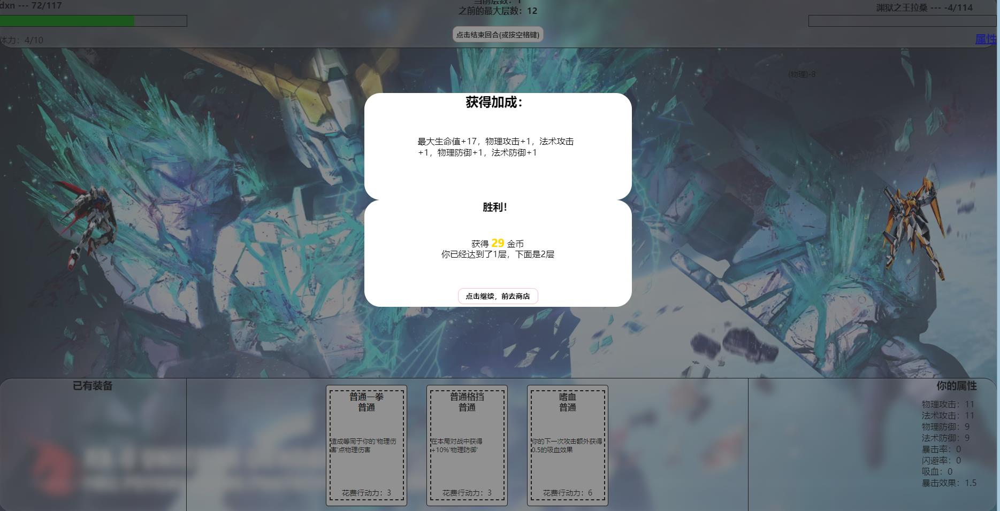
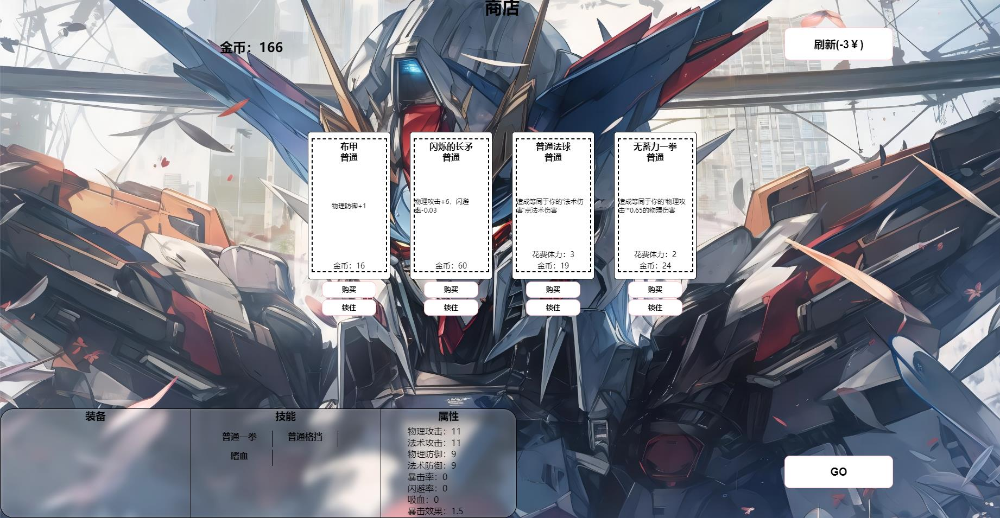
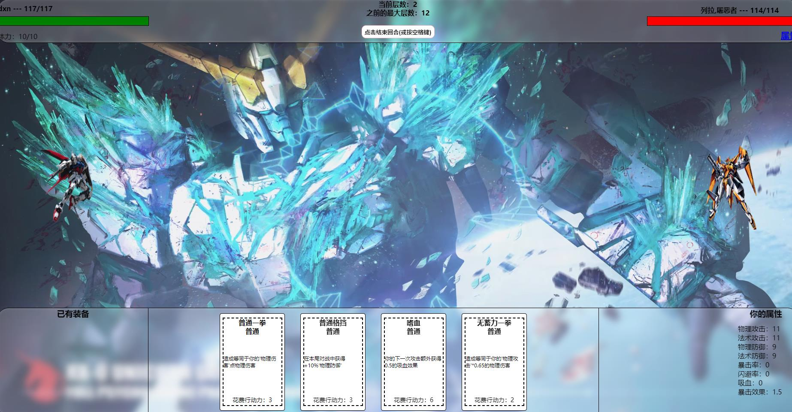

# 前言

区块链游戏目前已经慢慢的进入大众的视野当中，从僵尸游戏到区块链星际争霸，都预示着区块链游戏已经慢慢的成熟，本项目也是一个区块链游戏，本游戏基于FISCO BCOS联盟链，所需秘钥均为WeBASE-Front生成

## 环境

Ubuntu 20
FISCO BCOS 2.8
WeBASE-Front 1.5.4

# 操作

搭建FISCO BCOS联盟链单机四节点，front环境

启动前后端

npm install

npm run serve

然后就能看到我们的战斗环节了，为了保证拥有良好体验，我方拥有十点体力，请合理使用技能，击败对方，击败对方会有相应奖励，敌人属性会随着关卡提高而难度上升

战斗胜利后会有相应奖励，合理运用奖励购买装备以及技能，以便于后期通关
## 通关小技巧：角色阵亡后装备会掉落，但技能点不会

购买后属性装备和技能都会随之提升

上链：奖励上链，技能上链，角色上链

后期会开放团队作战，以及武器技能买卖，“捏脸”，时装，公共关卡等联机功能

# 本项目遵循FISCO BCOS开源社区规定，如需商用请联系社区小助手咨询

