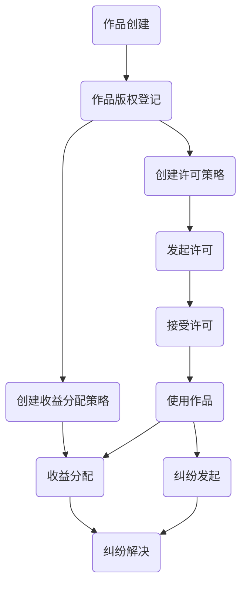

# 知识产权管理合约

## 一、 简介

这个知识产权管理合约主要用于解决版权登记、许可管理以及收益分配等方面的问题。通过将这些操作放在区块链上，我们可以实现一个公平、透明和去中心化的知识产权管理系统。以下是针对这个合约的场景和问题解决方案的说明。

> 场景和问题

- 作品版权登记：确保作品的原创性和所有权，防止抄袭、侵权等行为。
- 许可管理：为作品的使用许可提供一个去中心化的平台，实现有效的许可追踪和交易。
- 收益分配：确保作品的收益能够按照预定的比例公平、透明地分配给相关方。
- 纠纷解决：提供一个机制来处理与作品相关的纠纷，如侵权、许可冲突等。
  
## 二、 合约设计思路

以下是基于知识产权管理场景的智能合约规划思路。我们将实现一个主合约以及三个子合约：作品登记合约（CopyrightManager）、许可管理合约（LicenseManager）和收益分配合约（RoyaltyManager）。主合约将引用这三个子合约，并提供与它们的交互接口。

> CopyrightManager 合约主要功能：

- 存储作品的哈希值、作者信息、元数据和时间戳。

- 提供作品登记功能，允许版权所有者将作品登记到区块链上。

- 提供作品查询功能，允许用户查询作品的详细信息。

> LicenseManager 合约主要功能：

- 存储许可信息，如许可类型、许可持有者、有效期等。

- 提供许可查询功能，允许用户查询许可的详细信息。

> RoyaltyManager 合约主要功能：

- 存储作品的定价策略和收益记录。

- 提供收益分配功能，允许将收益按比例分配给多个参与者，如作者、出版商、代理商等。

> IntellectualPropertyManager 主合约主要功能：

- 引用 CopyrightManager、LicenseManager 和 RoyaltyManager 合约。

- 提供与子合约的交互接口，如作品登记、许可申请、收益分配等。

- 实现纠纷处理功能，如举报机制、调解与仲裁等。

- 实现数据透明与隐私保护功能，如公开透明和隐私保护等。

## 三、 业务流程图

收益分配等业务在业务场景中具体实现。

## 四、操作说明

以下是基于上述合约的全流程操作说明和示例。请注意，这里的示例以演示为目的，实际操作时可能需要根据实际情况进行调整。

> 部署子合约：

先部署 CopyrightManager、LicenseManager 和 RoyaltyManager 子合约。

> 部署主合约：

部署 IntellectualPropertyManager 主合约，并将子合约地址作为构造函数参数传入。

> 作品登记：
>
调用 registerWork 方法。需要提供作品哈希、标题和元数据作为参数。例如：

workHash: keccak256(作品内容)
title: "作品标题"
metadata: "作品相关元数据（例如作者、创建时间等）"

> 修改作品信息：

调用 updateWork 方法。需要提供作品哈希、新标题和新元数据作为参数。例如：

workHash: keccak256(作品内容)
newTitle: "新作品标题"
newMetadata: "新作品相关元数据"

> 撤销作品登记：

调用 revokeWork 方法。需要提供作品哈希作为参数。例如：
workHash: keccak256(作品内容)

> 授权许可：

调用 grantLicense 方法。需要提供作品哈希、许可类型、被许可者地址和许可有效期作为参数。例如：
workHash: keccak256(作品内容)
licenseType: 1（例如表示独家许可）
licensee: 被许可者的账户地址
validUntil: 许可有效期的Unix时间戳

> 修改许可：

调用 updateLicense 方法。需要提供作品哈希、许可索引、新许可类型和新许可有效期作为参数。例如：

workHash: keccak256(作品内容)
licenseIndex: 0（表示第一个许可）
newLicenseType: 2（例如表示非独家许可）
newValidUntil: 新许可有效期的Unix时间戳

> 撤销许可：

调用 revokeLicense 方法。需要提供作品哈希和许可索引作为参数。例如：

workHash: keccak256(作品内容)
licenseIndex: 0（表示第一个许可）

> 设置定价策略：

调用 setPricing 方法。需要提供作品哈希和价格作为参数。例如：

workHash: keccak256(作品内容)
price: 100（表示价格为100个单位）

> 更新收益分配：

调用 updateDistribution 方法。需要提供作品哈希、参与者地址和分配比例作为参数。例如：

workHash: keccak256(作品内容)
participant: 参与者的账户地址
percentage: 分配比例（例如10表示10%）

> 撤销定价策略：

调用 revokePricing 方法。需要提供作品哈希作为参数。例如：
workHash: keccak256(作品内容)

> 创建纠纷：

调用 createDispute 方法。需要提供作品哈希和纠纷原因作为参数。例如：

workHash: keccak256(作品内容)
reason: "侵犯知识产权"

> 解决纠纷：

调用 resolveDispute 方法。需要提供纠纷ID和解决结果作为参数。例如：

disputeId: 0（表示第一个纠纷）
success: true（表示纠纷解决成功）
