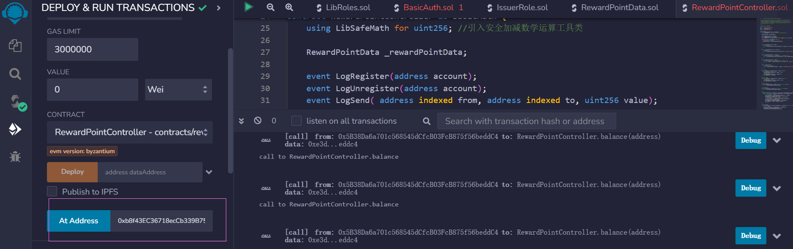

# RewardPoint积分系统注释及合约功能解析

## 1.介绍

基于区块链的积分系统，支持多家机构发行积分、用户注册、获取积分、消费积分，还可实现积分的转账、用户销户等功能。

## 2.系统角色

积分场景包括了以下角色：

- 管理者：积分系统的管理者。
- 发行者：发行积分

- 用户： 获得和消费积分，实现积分的转账。

## 3.功能说明

- 注册：用户注册会员，只有经过注册的用户才能获得和消费积分。
- 销户： 用户销户。只有积分为0的用户才能正常销户。
- 转账： 支持用户积分的互转和消费等。
- 积分销毁： 用户可以销毁自己的积分。
- 删除发行者： 发行者可以注销自身的发行积分的权利。
- 发行积分：发行者可以给用户发行积分
- 查询积分余额

## 4.合约设计

主体为3个合约： Admin、RewardPointController、RewardPointData。

其中Admin为管理合约，提供合约部署和管理的接口：

```
- 构造函数： 部署合约。默认部署合约的外部账户为资产发行者。
- upgradeVersion(address newVersion)  更新数据的controller最新地址
- _dataAddress() 查询数据合约的地址
- _controllerAddress() 查询控制合约的地址
```

RewardPointController 提供了合约控制相关的接口：

```
- addIssuer(address account) 添加资产发行者。只有资产发行者可以添加新的资产发行者。
- issue(address account, uint256 value) 发行积分
- isIssuer(address account) 判断是否是资产发行者。
- addIssuer(address account) 添加发行者,只能由发行者添加。
- renounceIssuer() 撤销发行者，只能撤销自己。
- register() 普通用户账户注册。
- unregister() 普通用户账户注销。
- isRegistered(address addr) 判断普通用户是否注册。
- balance(address addr) 查询普通用户的积分。
- transfer(address toAddress, uint256 value) 往目标账户转积分
- destroy(uint256 value) 销毁自己账户中的指定数量的积分
```

RewardPointData提供了底层的数据存储，不对外暴露直接访问的接口。

## 5.存储设计

### 账户积分数据存储合约RewardPointData

```solidity
contract RewardPointData is BasicAuth, IssuerRole {

    mapping(address => uint256) private _balances;  //保证注册账号数据
    mapping(address => bool) private _accounts; //保存账户余额数据
    uint256 public _totalAmount; //发行积分总额
    string public _description;  //描述信息
    address _latestVersion;  //最新的版本
    
    ......
 }
```

## 6.合约详细

### 6.1 Admin合约

```solidity
pragma solidity ^0.4.25;

import "./BasicAuth.sol";
import "./RewardPointController.sol";
import "./RewardPointData.sol";


//管理合约
contract Admin is BasicAuth {
    address public _dataAddress; 
    address public _controllerAddress;

    constructor() public {
        //创建RewardPointData合约,用于存储数据
        RewardPointData data = new RewardPointData("Point of V1");
        _dataAddress = address(data);
        //创建RewardPointController 合约,提供合约控制操作的接口
        RewardPointController controller = new RewardPointController(_dataAddress);
        _controllerAddress = address(controller);
        data.upgradeVersion(_controllerAddress);
        data.addIssuer(msg.sender);
        data.addIssuer(_controllerAddress);
    }

    //升级版本
    function upgradeVersion(address newVersion) public {
        RewardPointData data = RewardPointData(_dataAddress);
        data.upgradeVersion(newVersion);
    }
    
}
```

### 6.2 RewardPointController 合约

```solidity
pragma solidity ^0.4.25;

import "./RewardPointData.sol";
import "./BasicAuth.sol";
import "./LibSafeMath.sol";

//积分控制合约
contract RewardPointController is BasicAuth {
    using LibSafeMath for uint256; //引入安全加减数学运算工具类

    RewardPointData _rewardPointData; 

    event LogRegister(address account);
    event LogUnregister(address account);
    event LogSend( address indexed from, address indexed to, uint256 value);

    constructor(address dataAddress) public {
      //保存积分数据合约实例地址
      _rewardPointData = RewardPointData(dataAddress);
    }

    
    modifier accountExist(address addr) {
        //要求账户已经注册
        require(_rewardPointData.hasAccount(addr)==true && addr != address(0), "Only existed account!");
        _;
    }

    modifier accountNotExist(address account) {
        //要求账户未注册
        require(_rewardPointData.hasAccount(account)==false, "Account already existed!");
        _;
    }

    modifier canUnregister(address account) {
        //判断账户是否可以取消注册，要求账户已经注册且账户的余额是零
        require(_rewardPointData.hasAccount(account)==true && _rewardPointData.getBalance(account) == 0 , "Cann't unregister!");
        _;
    }

    modifier checkAccount(address sender) {
        //要求调用者地址非发送的目标地址,且发送的目标地址是有效的
        require(msg.sender != sender && sender != address(0), "Can't transfer to illegal address!");
        _;
    }

    modifier onlyIssuer() {
         //要求调用者是积分的发行者
        require(_rewardPointData.isIssuer(msg.sender), "IssuerRole: caller does not have the Issuer role");
        _;
    }

    //注册账户
    function register() accountNotExist(msg.sender) public {
       //保存账户地址，设置状态值为true
        _rewardPointData.setAccount(msg.sender, true);
        //初始化账号余额为0
        _rewardPointData.setBalance(msg.sender, 0);
        emit LogRegister(msg.sender);
    }

    //取消注册账户
    function unregister() canUnregister(msg.sender) public {
        //设置账户状态值为false
        _rewardPointData.setAccount(msg.sender, false);
        emit LogUnregister(msg.sender);
    }

    //判断是否已经注册
    function isRegistered(address addr) public view returns (bool) {
        return _rewardPointData.hasAccount(addr);
    }

    //查询账户的余额
    function balance(address addr) public view returns (uint256) {
        return _rewardPointData.getBalance(addr);
    }

    //转账
    function transfer(address toAddress, uint256 value) accountExist(msg.sender) accountExist(toAddress)
        public returns(bool b, uint256 balanceOfFrom, uint256 balanceOfTo) {
            //转账发送者扣减转账的金额
            uint256 balance1 = _rewardPointData.getBalance(msg.sender);
            balanceOfFrom = balance1.sub(value);
            _rewardPointData.setBalance(msg.sender, balanceOfFrom);
            //转账接收者的余额增加相应的转账金额
            uint256 balance2 = _rewardPointData.getBalance(toAddress);
            balanceOfTo = balance2.add(value);
            _rewardPointData.setBalance(toAddress, balanceOfTo);
            emit LogSend(msg.sender, toAddress, value);
            b = true;
    }

    //消耗指定的金额
    function destroy(uint256 value) accountExist(msg.sender) public returns (bool) {
        //积分总额度扣减
        uint256 totalAmount = _rewardPointData._totalAmount();
        totalAmount = totalAmount.sub(value);
        _rewardPointData.setTotalAmount(totalAmount);
        //调用者的账户余额扣减
        uint256 balance1 = _rewardPointData.getBalance(msg.sender);
        balance1 = balance1.sub(value);
        _rewardPointData.setBalance(msg.sender, balance1);
        emit LogSend( msg.sender, address(0), value);
        return true;
    }

    //发行积分
    function issue(address account, uint256 value) public accountExist(account) returns (bool) {
        //积分总额度增加发行的积分数量
        uint256 totalAmount = _rewardPointData._totalAmount();
        totalAmount = totalAmount.add(value);
        _rewardPointData.setTotalAmount(totalAmount);
        //给账户余额增加发行的积分数量
        uint256 balance1 = _rewardPointData.getBalance(account);
        balance1 = balance1.add(value);
        _rewardPointData.setBalance(account, balance1);
        emit LogSend( address(0), account, value);
        return true;
    }

    //是否是发行者
    function isIssuer(address account) public view returns (bool) {
        return _rewardPointData.isIssuer(account);
    }

    //添加发行者
    function addIssuer(address account) public returns (bool) {
        _rewardPointData.addIssuer(account);
        return true;
    }

    //撤销发行者
    function renounceIssuer() public returns (bool) {
        _rewardPointData.renounceIssuer(msg.sender);
        return true;
    }
}


```

### 6.3 RewardPointData合约

```solidity
pragma solidity ^0.4.25;

import "./BasicAuth.sol";
import "./IssuerRole.sol";

//积分数据存储合约
contract RewardPointData is BasicAuth, IssuerRole {

    mapping(address => uint256) private _balances;  //保证注册账号数据
    mapping(address => bool) private _accounts; //保存账户余额数据
    uint256 public _totalAmount; //发行积分总额
    string public _description;  //描述信息
    address _latestVersion;  //最新的版本

    constructor(string memory description) public {
        _description = description;
    }

    modifier onlyLatestVersion() {
       require(msg.sender == _latestVersion);
        _;
    }

    //升级版本
    function upgradeVersion(address newVersion) public {
        require(msg.sender == _owner);
        _latestVersion = newVersion;
    }
    

    //设置账户的积分余额
    function setBalance(address a, uint256 value) onlyLatestVersion public returns (bool) {
        _balances[a] = value;
        return true;
    }

    //设置账户的状态值为true，代表已经注册
    function setAccount(address a, bool b) onlyLatestVersion public returns (bool) {
        _accounts[a] = b;
        return true;
    }

    //设置积分总额度
    function setTotalAmount(uint256 amount) onlyLatestVersion public returns (bool) {
        _totalAmount = amount;
        return true;
    }

    //获取账户的状态，及积分余额
    function getAccountInfo(address account) public view returns (bool, uint256) {
        return (_accounts[account], _balances[account]);
    }

    //返回账户是否已经注册
    function hasAccount(address account) public view returns(bool) {
         return _accounts[account];
    }

   //获取账户的余额
    function getBalance(address account) public view returns (uint256) {
        return _balances[account];
    }
   
}


```

### 6.4 BasicAuth合约(权限辅助操作)

```solidity

pragma solidity ^0.4.25;


//权限辅助操作
contract BasicAuth {
    address public _owner;

    constructor() public {
        _owner = msg.sender;
    }

    modifier onlyOwner() { 
        require(auth(msg.sender), "Only owner!");
        _; 
    }

    function setOwner(address owner)
        public
        onlyOwner
    {
        _owner = owner;
    }
    
    function auth(address src) public view returns (bool) {
        if (src == address(this)) {
            return true;
        } else if (src == _owner) {
            return true;
        } else {
            return false;
        }
    }
}
```


## 7.功能测试

### 部署ADMIN合约

编译ADMIN合约并部署.


获取 ADMIN合约中部署的RewardPointController 合约地址。

### 获取RewardPointController 合约实例

获取RewardPointController 合约地址后，使用remix At Address功能，获取已部署的RewardPointController 合约实例，如下：



### 发行积分


### 查询余额


### 注册用户


### 积分转账

