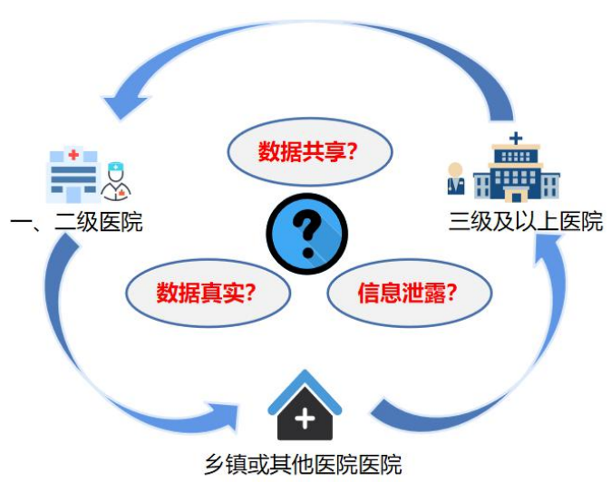
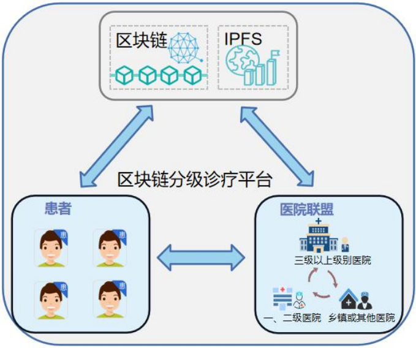
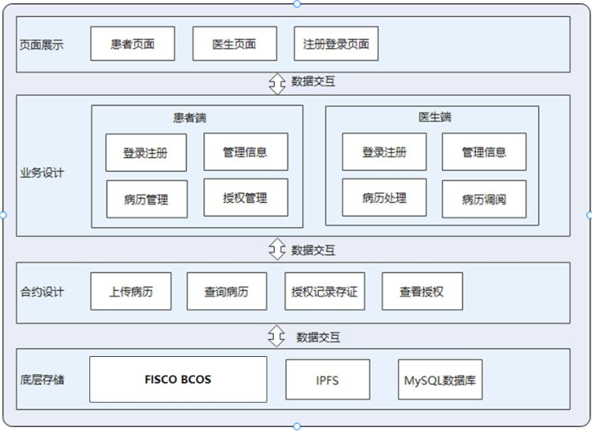
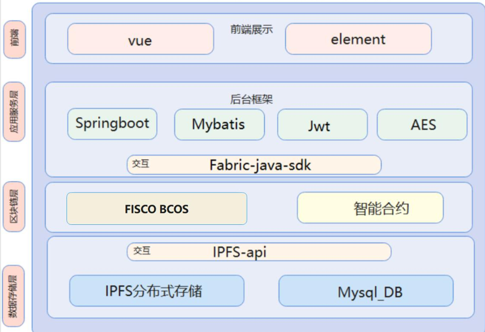
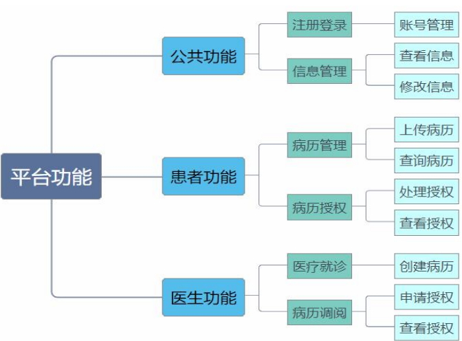
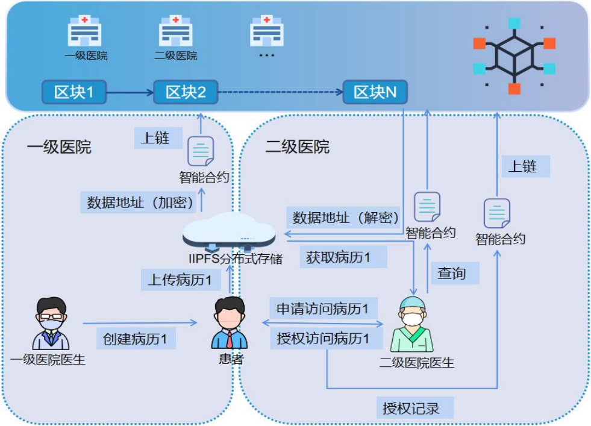
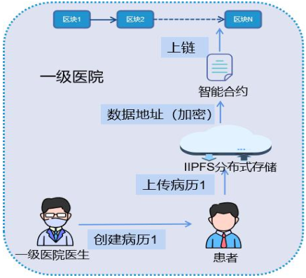
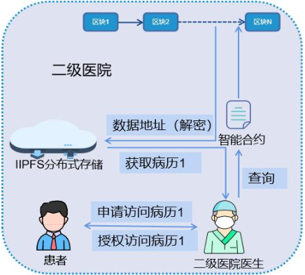
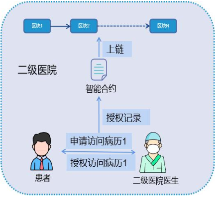

# 基于区块链的分级诊疗数据共享案例 

***★知识要点★***

- 研究背景
- 研究目标
- 平台设计

## 1. 研究背景

分级诊疗是合理配置医疗资源、改善民生，提高
全民健康水平的重要举措。2015年，国务院办公厅就
印发了《关于推进分级诊疗制度建设的指导意见》。
部署加快推进分级诊疗制度建设。构建医疗机构间的
数据共享是推进分级诊疗的关键。中共中央国务院在
《“健康中国2030”规划纲要》中就强调要完善医疗服
务体系、创新医疗服务供给模式，建立信息共享、互
联互通机制。
##  2. 现有平台存在的问题

1. 各级医院间无法建立协商一致的标准，导致数据共享难。
2. 各级医院间数据传输不能确保信息的可靠性及可追溯性，导致医患矛盾
解决难。
3. 患者在不同医院诊疗产生的信息极易泄露，导致患者维护病历所有权难

## 3. 研究目标 

基于区块链的技术特点，探索应用区块链技术解决医疗机构分级诊
疗平台存在的数据打通和数据安全等技术问题，为区块链技术应用于分
级诊疗提供典型案例，为区块链技术的落地及相关研究提供一定的借鉴
意义。
## 4. 平台设计
利用联盟链将各级医院组成医院联盟，每家医院为一个全节点，让不同级别医院共同参与管理，
结合IPFS分布式存储，实现医疗数据共享；在跨院就诊时，历史医疗信息由患者授权，有效保证患者对自
身病历的控制权；此外，患者分级诊疗流程记录在链上存证。

## 5. 系统架构
1. 页面展示：面向患者和医生，可供患者上传、查询病历及授权记录，可供医生创建和查看患者病历，查看病历前需申请患者授权。
2. 业务设计：收集来自前端以及合约层的数据，进行增加、更新等处理，实现对链上链下存储系统接口的调用，以及对
数据加密操作。
3. 合约设计：用于执行链上关键业务逻辑，本系统主要包含病历关键信息的记录和授权信息的记录两个核心智能合约。
4. 底层存储：采用链上链下结合存储数据。链上存储病历关键信息和授权信息，链下利用IPFS存储病历完整信息，其余数据由本地MySQL数据库存储。

## 6. 技术架构

## 7. 系统功能

### 7.1 公共功能
对于初次使用系统的患者，需要通过注册登录模块，在注册界面对个人信息进行登记，创建患者用户角色。就诊患者或
医生使用本系统时，必须通过账号，选择所属的医院进行登录。此外，用户可以通过基本信息管理模块，对个人信息进行查
看和修改。
### 7.2 患者功能
对于患者而言，主要包括病历管理以及病历授权两个模块。病历信息管理模块的主要功能是让患者能够上传到区块链上
进行存证，以及查询自己病历。病历授权管理模块的功能包括对医生端提交的申请进行处理，以及提供信息授权列表，让患
者能够知晓电子病历的授权情况。
### 7.3 医生功能
医疗就诊模块是对就诊患者进行建档，生成电子病历。病历调阅模块可以实现不同医院的医生查看患者的医疗信息，在这个过
程中，医生需要向患者发出申请。
## 8.业务流程

以患者跨两级医院就诊为例，关键流程包括患者病历信息加密上链、跨医院就诊授权医生访问病历、授权记录上链存证。
### 8.1 病历关键信息上链

患者在一级医院就诊后，医生负责创建病历，待双方确认无误后，完整病历由患者上传，存储至IPFS
中，对存储返回的地址进行AES对称加密，把加密后的存储地址存在链上，完成就诊关键信息上链。
### 8.2 申请授权

患者在转到二级医院就诊时，即跨医院就诊。医生查看患者病历前需要先提出申请，待患者同意后，
二级医院医生方可查阅患者病历，从而有效实现了病人对自己病历的控制权，不同医院间的相互查阅病历，
有效实现了数据共享。
### 8.3 授权记录存证

患者的每次授权行为都会记录在链上存证，使得患者更加清晰病历的去向，就诊全流程记录与存证，
有效减少医患矛盾产生。