# Solidity进阶教程


★知识要点★***

- 编码规范的一些简单建议
- 智能合约中的一些开发技巧
- 智能合约的升级思路设计
- 智能合约的底层代码调用
- 智能合约的外部调用
- 智能合约的工厂设计模式


## 1. 编码规范

编码规范是招聘单位很重视，但却又容易被个人开发者所忽视的一个环节。编码规范多少能体现一个人的品味，有的时候有些作者会把自己的喜好强加于人，例如Go语言在设计时，通过一个代码美化进程“刻板”的去调整开发者编写的代码，让Go语言代码的风格能够保持大方向上的统一。Go语言这种方式虽然霸道，却为后续的开发者提供了便利，当大家编码风格基本一致时，阅读源码就会方便很多。

编码规范以及习惯，我认为最好是在大学期间养成。说实话，讲编码风格是存在争议的。但是，在看到一些学生发给我的代码后，个人觉得确实有必要强调一下。

### 1.1 书写风格

代码书写风格最大的基本原则就是代码清晰好看，设身处地的想，当你把一坨代码交给某位“高手”去阅读分析时，对方看到杂乱的代码后，可能一点帮助你的心思都没有！代码风格不好看，给人的印象分就会降低。

下面，我会列举几个代码编写时的风格建议，只是建议。

第一个，合理***利用空格分割函数参数***。这也是我近期阅读学生代码时的第一印象，例如下面的例子。

```js
function isEqual(string memory str1,string memory str2) public pure returns(string memory);
```

上述代码看上去问题不大，不过阅读时确实会让某些强迫症的资深开发者难受，我们通常的建议是参数之间用空格隔开。下面的代码只是多了一个空格，看上去就舒服一些。

```js
function isEqual(string memory str1, string memory str2) public pure returns(bool);
```

第二个，***函数声明太长可以合理使用换行***。上面的函数声明已经够长了，如果参数更多的话，就可以考虑将函数换行声明了。例如，改成下面的风格，这样看上去更清楚。

```js
function isEqual(
		string memory str1, 
    string memory str2
    ) 
		public 
    pure 
    returns(bool);
```

第三个要说的是函数体内部的缩进控制。这个其实大多数语言一样，在这里就不展开说了，举个反例就好。

```js
function isEqual(
		string memory str1, 
    string memory str2
    ) 
		public 
    pure 
    returns(bool) {
				bytes memory bstr1 = bytes(str1);
    bytes memory bstr2 = bytes(str2); // 不好的缩进风格
        if(bstr1.length != bstr2.length) return false;
        for(uint i = 0; i < bstr1.length; i ++) {
        if(bstr1[i] != bstr2[i]) return false; // 不好的缩进风格
        }
				return true;
    }
```


### 1.2 命名规则

命名规则仍然是编码规范中的一个重要细节。以太坊整体上有着自己的命名规则，所以在变量或函数声明时，还是遵守以太坊的命名规则比较好。某一个变量或函数如果包含几个单词，那么可以直接把所有单词连接在一起，除了第一个单词外，其余单词的首字母大写，例如获取余额，使用的函数名是`balanceOf`，再比如想要查看某个账户第n个NFT藏品，那么使用的函数名为`tokenOfOwnerByIndex`。

由于Solidity的特殊性，除了函数或变量的命名原则外，也会存在一些约定的规则。

第一，***内部函数***使用`_`作为前缀。Solidity在写合约时，除了提供对外服务的函数，也有一些内部处理数据的函数，这类函数通常定义为internal或private，此时的函数推荐使用`_`作为前缀来区分其他函数。如果沿用这个原则的话，一些私有的状态变量在声明时也会使用`_`作为前缀。例如下面的例子。

```js
string private _name; // 私有变量
function _transfer(address to, uint256 amount) internal; // 内部函数
```


第二，接口名前使用Interface的I来作为开头。例如定义存证合约（Evidence）的接口可以声明为IEvidence。

第三，函数参数名使用`_`。这里可能会和第一条有些矛盾，因此大家可以根据实际情况选择。函数参数传递很多时候是为了改变状态变量，因为函数参数名和状态变量名会有类似的地方，一种简单的做法是将函数参数使用`_`作为前缀。例如，可以像下面的方式定义修改函数。

```js
uint256 count;
function setCount(uint256 _count) public;
```

关于命名规则的问题，在这里也仅是抛砖引玉。开发者可以根据自身的习惯灵活设计，大的原则还是尽量让大多数人能够接受。


## 2. 开发技巧

对于开发者来说，编程就像摆弄乐高玩具，掌握了基本的玩法后可以根据自己头脑中的理念设计成有意思的程序。所谓编程，也就是灵活的运用规则作出好玩的“玩具”。在实践的过程中，一些开发者会逐渐积累一些开发过程中的经验，它们可能会是某个特定问题的处理技巧，或者是某个需求的解决方案。下面，我们就来介绍几个Solidity编写时的技巧。

### 2.1 迭代器遍历mapping

mapping是Solidity中非常重要的数据结构，mapping和数据不太一样，由于它是不规则的key-val组合，因此我们是没办法直接遍历map的。

下面的例子是一个遍历mapping的解决方案。这类似一个迭代器的解决思路，通过一个数组结构来存储mapping中的key值，每增加一组key-val数据时，在数组中维护一次key值，这样通过遍历数组的方式可以变相的解决mapping遍历的问题。代码中数组names就是遍历mapping的关键，addStudent是一个添加学生成绩的函数，在添加时，同步添加学生姓名到数组names中。想要统计全体学生的成绩总和时，getSum在实现时就可以遍历拿到names中所有key来获取所有的val。

```js
contract mapping_iterator {
    mapping(string=>uint256) points;
    string[] names;
    
    function addStudent(string memory _name, uint256 _point) public {
        require(points[_name] == 0, "student already exists");
        
        points[_name] = _point;
        names.push(_name);
    }
    
    function getSum() public view returns (uint256) {
        uint256 sum = 0;
        for(uint256 i = 0; i < names.length; i ++) {
            sum += points[names[i]];
        }
        
        return sum;
    }
}
```


### 2.2 外部合约调用

大家在写智能合约时，都会有个习惯，在写pure或view函数的时候肯定会写返回值，但是在写对状态变量修改类的函数时往往不写返回值，因为在外部调用时，这类函数是拿不到返回值的，写了也没意义。这样理解只能说对了一半儿，外部调用拿不到返回值，不代表所有的调用都拿不到返回值。本小节，我们介绍的合约调用是可以拿到返回值的。

就像是进程间可以通信一样，智能合约之间也可以互相调用。很容易想到的是在已知合约地址和合约源码的情况下，能够调用该合约。下面定义了一个A合约。

```js
contract A {
    string  name;
    uint256 count;
    
    function setData(string memory _name, uint256 _count) public returns (bool) {
        name = _name;
        count = _count;
        if(count <= 2000) return false;
        return true;
    }
    
    function getName() public view returns (string memory) {
        return name;
    }
    
}
```

想要调用A合约内的方法时，把A合约当成一种数据类型，当使用它对某个地址进行强转时就得到了A合约对象，从而就可以调用A合约内的外部方法。

下面就是针对A合约的调用例子，call_demo内部的两个函数分别调用了A合约内的两个函数。

```js
contract call_demo {
    // 调用A合约的setName
    function setData(address _addr, string memory _name, uint256 _count) public {
      	// A(_addr)相当于得到了A合约对象
        A(_addr).setData(_name, _count);
    }
    // 调用A合约的getName
    function getName(address _addr) public view returns (string memory) {
        return A(_addr).getName();
    }
}
```

测试合约时，可以先部署A合约，然后部署B合约，在B合约内调用setData函数时，传入A合约地址，就可以完成对A合约的调用。效果如下图所示。

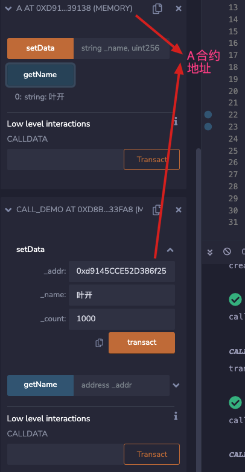

接下来，我们再测试一下合约调用返回值的问题。修改call_demo合约里的setData函数，使用require判断函数的返回值。

```js
function setData(address _addr, string memory _name, uint256 _count) public {
        require(A(_addr).setData(_name, _count), "failed to call A");
    }
```

再次部署call_demo合约，进行调用测试，先传递一个小于2000的数值，如下图所示。由于返回值为false，所以合约执行将会报错。

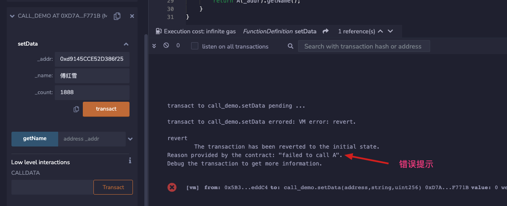

接下来，再使用更大的数值来测试一下，效果如下图。可以看到，合约能够顺利运行。


结论，通过地址和源码就可以调用其他外部合约，而且函数的返回值是有意义的。


### 2.3 接口和继承

前一小节介绍了调用外部合约时需要合约的地址和源码，但每次都拿到合约源码才能完成调用显得太繁重了，尤其是分工协作的项目开发，一方要等另一方的代码开发完再工作会导致项目周期大大增加。在项目工程中，通常都会先定义好接口，然后大家再分头开发。

在Solidity语言当中，也可以使用Interface来定义接口，这样就可以做到接口设计与代码实现分离，另外，对于调用者来说，只需要知道接口和合约地址同样可以调用实现了该接口的合约内的方法。接口定义的示例如下，具体的实现无需提供。

```js
// 接口仅仅定义，不实现
interface IA {
    function setCount(uint256 _count) external;
    function getCount() external view returns (uint256);
}
```

在实现接口时，只需要使用is关键字就可以继承该接口，0.6版本的编译器开始，要求对于接口方法的实现需要加override关键字来代表覆盖接口实现。接口定义另外需要注意的是，接口内的函数要定义成external类型，不能定义成其它访问限制方式。

接口的设计方式除了降低耦合度外，也让合约升级变得方便，接口调用一方只需要更换一下调用的合约地址即可（在接口不变的大前提下），后面会介绍合约升级的相关思路。

除了接口可以使用is关键字来继承外，is关键字本身也能够继承其它已经实现的合约，继承时会自动继承该合约的属性和方法。下面的示例是一种简单的继承。

```js
contract A {

    function setCount(uint256 _count) override external {
        count = _count;
    }
    function getCount() 
        override 
        external 
        view 
        returns (uint256) {
        return count;
    }
}
contract C is A {
}
```

合约在继承时，也可以同时继承多个合约。下面是一个多合约继承的示例。

```js
abstract contract B {
    string name;
    function getName() public view returns (string memory) {
        return name;
    }
}

contract C is A, B {}
```

在这里，abstract关键字表明B合约是一个抽象的，此时B合约不能创建合约对象，只能被继承使用。

一个接口是由多个函数（方法）组成的，外部调用时需要指明要调用的具体方法，这个指明方式就是通过calldata的前4个字节决定，这前4个字节就是函数签名。Solidity语言中，计算函数签名，可以通过keccak256计算该函数原型的哈希值后截取前4个字节。计算方式需要注意一下，需要去掉函数中参数名称，并且去掉多余的空格，再进行哈希值计算，例如`function setAge(uint256 _age) external;`计算公式为：`bytes4(keccak256("setAge(uint256)"))`。除了通过哈希计算外，Solidity也提供了直接获取哈希值的方式：selector。下面的代码中，getFuncSig提供了2种获取函数签名的方式，IUser.setAge.selector正是获取IUser接口内setAge函数的签名。

```js
interface IUser {
    function setAge(uint256 _age) external;
    function getName() external view returns (string memory);
}

contract User is IUser {
    function setAge(uint256 _age) override external {}
    function getName() override external view returns (string memory) {}
    
    function getFuncSig() public view returns (bytes4, bytes4) {
        bytes4 setAgeSig = bytes4(keccak256("setAge(uint256)"));
        return (setAgeSig, IUser.setAge.selector);
    }
}
```

部署该合约，测试getFuncSig的返回结果，如下图所示。

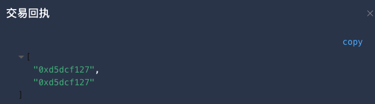

与接口相关的还有接口ID，接口ID就是把一个interface（或合约）内所有函数的签名进行异或，就可以得到接口ID，在NFT合约中，需要支持ERC165标准，该标准的实现基础就是接口ID。一个简单获得接口ID的方式是使用type关键字强转接口或合约名之后取interfaceId。例如，下面的getID函数分别演示了两个办法获取接口ID，两个返回值都是0xc20b2f5b。

```js
function getID() public view returns (bytes4, bytes4) {
        return (type(IUser).interfaceId, IUser.setAge.selector ^ IUser.getName.selector);
    }
```


### 2.4 工厂模式

当一名资深开发者和你聊技术方案实现时，那可能会从他口中听到各种设计模式的使用，在Solidity语言中，同样也存在一些相对固定的设计模式，我们接下来介绍一下较为常见的工厂模式。

工厂模式的简单思想就是某“产品”类合约对象不由合约本身创建，而是由工厂合约来创建和管理。通过工厂合约，可以批量地生产标准化的合约对象。在Solidity的工厂模式中，主要是创建“产品”合约的对象，并管理其地址。

例如下面是一个简单的资产类合约。

```js
pragma solidity ^0.6.10;

contract Asset {
    address public issuer;
    string public symbol;
    mapping (address => uint256) public balanceOf;

    event Sent(address from, address to, uint256 amount);

    constructor(string memory _sym, address _issuer) public {
        issuer = _issuer;
        symbol = _sym;
    }

    function issue(address _receiver, uint256 _amount) public {
        require (msg.sender == issuer, "only issuer can do");
        balanceOf[_receiver] += _amount;
        emit Sent(address(0), _receiver, _amount);
    }
    
}
```

接下来，可以编写一个工厂合约，负责创建Asset合约对象，并管理创建的合约地址，根据之前的介绍，有了合约地址，再拥有合约代码（接口）就可以对该合约进行调用了。

下面的示例是通过工厂合约创建Asset的示例。将之前的合约文件保存为Asset.sol文件，在工厂合约中需要import该文件，newAsset函数调用Asset合约的构造函数来创建合约对象，getAsset函数通过版本号来获取Asset的合约地址。这种方式很像是fisco-bcos环境提供的智能合约命名管理系统。

```js
pragma solidity ^0.6.10;

import "./Asset.sol";

contract Factory {
    mapping(string=>address) assets;
    
    // 创建资产
    function newAsset(string memory _sym, string memory _version) public {
        require(assets[_version] == address(0), "version already exists");
        Asset asset = new Asset(_sym, msg.sender);
        assets[_version] = address(asset);
    }
    // 通过版本获得各个资产合约的地址
    function getAsset(string memory _version) public view returns (address) {
        return assets[_version];
    }
}
```


### 2.5 整数溢出问题

2.4例子中的Asset资产内使用了加法运算符，其实这样直接计算并不安全（solidity0.8版本以上的编译器修正了该问题），会导致数学上的溢出。

举一个简单的例子，如果把之前的Asset合约的uint类型修改uint8，则很快就可以发现问题所在。合约代码调整如下。

```js
pragma solidity ^0.6.10;

contract Asset {
    address public issuer;
    string symbol;
    mapping (address => uint8) public balanceOf;

    event Sent(address from, address to, uint amount);

    constructor(string memory _sym, address _issuer) public {
        issuer = _issuer;
        symbol = _sym;
    }

    function issue(address _receiver, uint8 _amount) public {
        require (msg.sender == issuer, "only issuer can do");
        balanceOf[_receiver] += _amount;
        emit Sent(address(0), _receiver, _amount);
    }
    
}
```

部署该合约后，调用issue函数两次（同一个地址，每次192），如下图所示，此后查询balanceOf拿到的数据将是128。

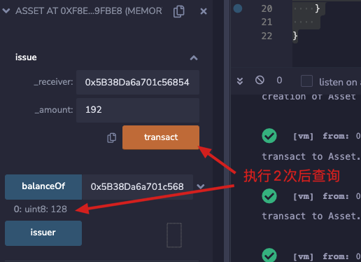

产生这样现象的原因就是因为uin8所表达的数据上限为255，192+192已经超过了这个上限，此时就产生了加法溢出。区块链历史上就因为加法溢出导致出现了非常严重的安全事故，目前成熟的做法是使用安全数学计算库SafeMath。具体代码如下。

```js
pragma solidity ^0.6.0;

/**
 * @title SafeMath
 * @dev Math operations with safety checks that revert on error
 */
library SafeMath {

  /**
  * @dev Multiplies two numbers, reverts on overflow.
  */
  function mul(uint256 a, uint256 b) internal pure returns (uint256) {
    // Gas optimization: this is cheaper than requiring 'a' not being zero, but the
    // benefit is lost if 'b' is also tested.
    // See: https://github.com/OpenZeppelin/openzeppelin-solidity/pull/522
    if (a == 0) {
      return 0;
    }

    uint256 c = a * b;
    require(c / a == b);

    return c;
  }

  /**
  * @dev Integer division of two numbers truncating the quotient, reverts on division by zero.
  */
  function div(uint256 a, uint256 b) internal pure returns (uint256) {
    require(b > 0); // Solidity only automatically asserts when dividing by 0
    uint256 c = a / b;
    // assert(a == b * c + a % b); // There is no case in which this doesn't hold

    return c;
  }

  /**
  * @dev Subtracts two numbers, reverts on overflow (i.e. if subtrahend is greater than minuend).
  */
  function sub(uint256 a, uint256 b) internal pure returns (uint256) {
    require(b <= a);
    uint256 c = a - b;

    return c;
  }

  /**
  * @dev Adds two numbers, reverts on overflow.
  */
  function add(uint256 a, uint256 b) internal pure returns (uint256) {
    uint256 c = a + b;
    require(c >= a);

    return c;
  }

  /**
  * @dev Divides two numbers and returns the remainder (unsigned integer modulo),
  * reverts when dividing by zero.
  */
  function mod(uint256 a, uint256 b) internal pure returns (uint256) {
    require(b != 0);
    return a % b;
  }
}
```

分析其思想，就是在做运算的时候，再检测一遍结果是否符合预期。我们可以把其中的加法和加法拿出来，单独形成一个针对uint8类型的库来测试一下效果。

```js
pragma solidity ^0.6.10;

library SafeMathForUint8 {
    function sub(uint8 a, uint8 b) internal pure returns (uint8) {
        assert(b <= a);
        return a - b;
    }

    function add(uint8 a, uint8 b) internal pure returns (uint8) {
        uint8 c = a + b;
        assert(c >= a);
        return c;
    }
}
```

再次改造Asset合约，在其内部增加SafeMathForUint8库的引用和调用。

```js
pragma solidity ^0.6.10;
import "./SafeMathForUint8.sol";

contract Asset {
    address public issuer;
    string symbol;
    using SafeMathForUint8 for uint8; // 声明使用库
    mapping (address => uint8) public balanceOf;

    event Sent(address from, address to, uint amount);

    constructor(string memory _sym, address _issuer) public {
        issuer = _issuer;
        symbol = _sym;
    }

    function issue(address _receiver, uint8 _amount) public {
        require (msg.sender == issuer, "only issuer can do");
        //balanceOf[_receiver] += _amount;
        balanceOf[_receiver] = balanceOf[_receiver].add(_amount); // 库的使用add(a, b) ==> a.add(b)
        emit Sent(address(0), _receiver, _amount);
    }
    
}
```

再次部署该合约，并且再次执行之前的issue调用，当两次的和超过255时，将会发生溢出异常，这样就确保了数学计算上的安全。


## 3. 智能合约底层调用与升级

智能合约是否具备升级能力一直是一个争议话题，从区块链的不可篡改性角度来说，智能合约一旦发布就不能更改，如果还能更改那就不符合区块链本意了。从IT开发角度来说，大家也都知道不出错误的程序是很少的，因此如果合约不能升级也会对应用的使用产生巨大影响。这个问题没有答案，仁者见仁，智者见智。

所谓的智能合约升级也是伪升级，它只是做到了对外暴露的合约地址不变，但通过合约内部的数据变更（变更操作合约的地址）来影响逻辑操作，这也是智能合约升级的本质。

### 3.1 fallback函数与底层的call调用

fallback是Solidity语言中，提供的一个特殊函数，当外部调用发生时，通过calldata的前4个字节来决定调用哪一个函数，如果能够匹配则调用对应的函数，如果不能匹配则会调用fallback函数。也就是说fallback函数相当于一个兜底儿的函数。

fallback函数原型如下，合约部署后在remix环境是不可见的。

```js
fallback() external ;
```

下面的合约内定义了fallback函数，并使用LogCalled这个event来验证是否被调用。

```js
contract fallback_demo {
    uint256 count;
    // 为了验证fallback被执行
    event LogCalled(address indexed _operator, uint256 _count, string remark);
    fallback() external  {
        count += 1;
        emit LogCalled(msg.sender, count, "fallback has be called");
    }
    
    function setCount(uint256 _count) public {
        count = _count;
        emit LogCalled(msg.sender, count, "setCount has be called");
    }
}
```

之前我们介绍通过合约接口对象的方式无法做到调用fallback，我们可以借助底层提供的call方法来完成调用。call方法的原型是。

```js
addr.call(abi.encodeWithSignature(selector,[param list]));
```

abi.encodeWithSignature的作用是将函数签名（selector）以及参数编码形成calldata，并由call来发起调用。下面的test_call合约是一个测试例子，callSet函数会调用fallback_demo合约内的setCount函数，callFallback会调用fallback_demo合约内一个不存在的函数名称，这样就会触发fallback函数被调用。

```js
contract test_call {
    
    function callSet(address _addr) public {
        _addr.call(abi.encodeWithSignature("setCount(uint256)", 100));
    }

    function callFallback(address _addr) public {
        _addr.call(abi.encodeWithSignature("set(uint256)", 200)); // set函数不存在
    }
}
```

可以在remix环境部署fallback_demo和test_call两个合约，然后通过test_call测试。如下图所示，将fallback_demo合约的地址传递给callSet调用，将会看到Log输出情况，fallback_demo合约内的setCount已经被调用了。

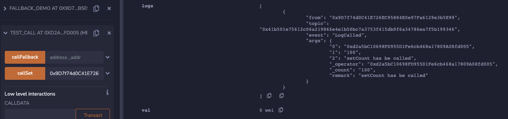

采用相同的套路调用callFallback，同样可以看到Log的输出情况，fallback函数被触发了。

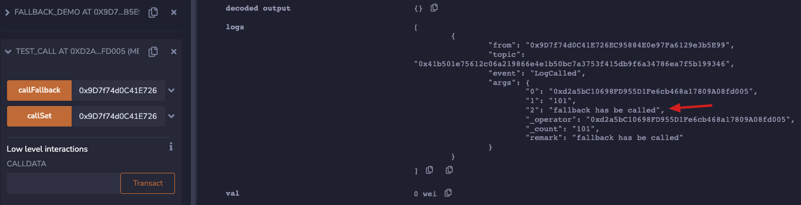

细心的同学可以看到，Log中_operator参数是test_call合约的地址，而并非我们调用callSet或callFallback的外部账户，这和我们通过合约对象去调用另外一个合约时的现象是一样的，当发生跨合约调用时，系统会创建一个新的EVM运行新的合约，并且将原调用数据的msg.sender替换为当前合约的地址。

### 3.2 delegatecall底层调用

与call对应的，Solidity语言也给我们提供了另外一个底层调用方式，那就是delegatecall，可以理解为委托调用。delegatecall与call的本质区别是它不会去修改msg.sender，而会把原始的调用数据发给新的合约。

另外，无论call还是delegatecall都属于底层调用，编译器都会提示我们要处理返回值，它们的返回值有2个，一个是bool值的成功失败标志，另外一个是字节数据存放错误时的错误信息。改造一下test_call，在里面增加delegatecall的使用，并处理返回值的检查。代码如下。

```js
contract test_call {

    function callSet(address _addr) public {
        (bool isSucess, ) = _addr.call(abi.encodeWithSignature("setCount(uint256)", 100));
        require(isSucess, "failed to call setCount");
    }

    function callFallback(address _addr) public {
       (bool isSucess, ) = _addr.call(abi.encodeWithSignature("set(uint256)", 200));
       require(isSucess, "failed to call fallback");
    }

    function delegatecallSet(address _addr) public {
        (bool isSucess, )  = _addr.delegatecall(abi.encodeWithSignature("setCount(uint256)", 100));
        require(isSucess, "failed to call setCount");
    }

    function delegatecallFallback(address _addr) public {
        (bool isSucess, )  = _addr.delegatecall(abi.encodeWithSignature("set(uint256)", 200));
        require(isSucess, "failed to call fallback");
    }
}
```

部署该合约，通过调用delegatecallSet时，可以发现Log中的msg.sender实际上还是外部账户。

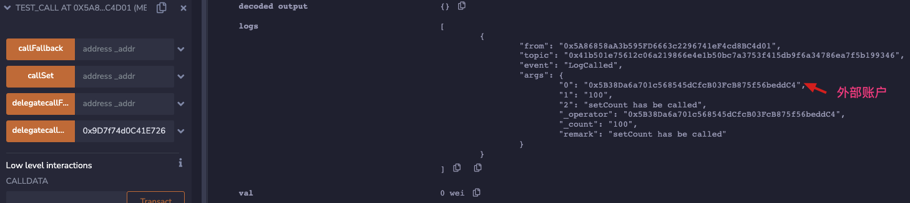


### 3.3 主-从式升级

之前介绍的内容，属于智能合约升级的预备知识，接下来我们介绍智能合约升级的思路。

智能合约升级的基本要求是合约地址不变，在这个基础上很容易可以设计出主-从模式。主-从式可升级合约，就是提供一个主合约，其地址永远不变，通过主合约可以获取从合约地址，通过数据结构的设计，可以在主合约内变更从合约的地址，主合约内部也可以设置多个从合约。这是比较简单的可升级智能合约设计。

这种合约的设计思路很像我们之前介绍的工厂合约，因此代码部分在这里不再展开介绍。

### 3.4 永久存储式升级

除了主-从模式，智能合约也可以采用永久存储合约，或者称为逻辑-存储合约。这种设计的特点是逻辑处理与数据分离，数据合约永久不变，逻辑合约则可以根据需要多次升级。

这种模式的设计思路就是保证数据的稳定性，对于数据的处理方式可以发生变化，相比而言也比较简单，具体案例就不再展开介绍了，因为下一个可升级模式会函盖永久存储合约这种模式。

### 3.5 存储代理式升级

存储代理合约，实际上这种设计模式存在着三层合约结构设计，包括代理、逻辑、存储结构三层。其中代理合约永恒不变，提供永久存储并负责委托调用逻辑合约，对应用程序提供访问接口；逻辑合约负责数据处理；存储结构合约负责定义存储结果，并被逻辑合约和代理合约继承。它们之间的关系如下图所示。

​                        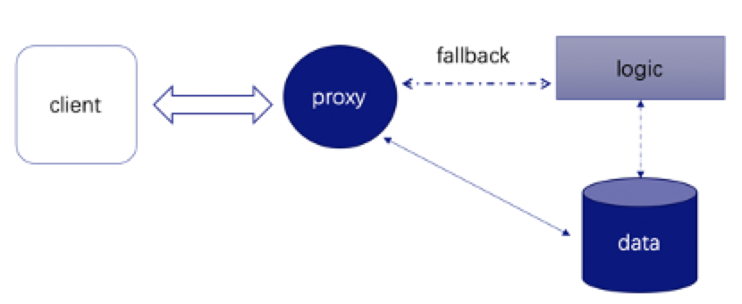       

存储代理模式下，逻辑合约和存储结构合约并我们来说没有什么难度，关键是代理合约的实现，如何通过代理合约能够自动的去调用逻辑合约内的函数。一种简单直接的方式是在代理合约内把逻辑合约的函数调用依次实现，但这样太繁琐了，而且逻辑合约在未来会出现需要升级的情况，一旦升级了，接口变化了，代理合约的逻辑也需要跟着变，而显然代理合约是不能重新发布的。

这时，就可以借助delegatecall+fallback的组合模式，让代理合约简单粗暴。

我们可以先编写一个数据存储合约，它是逻辑合约和代理合约的基础。示例如下，通过implementation记录逻辑合约的地址，points结构来记录一个具体的分数。

```js
//定义数据合约
contract storageStructure {
    //记录球员和分数
    address public implementation;//合约实现地址（逻辑地址）
    mapping(address=>uint256) public points;
    uint256 public totalPlayers;
    address public owner;
}
```

接下来，编写一个有问题的逻辑合约，为以后升级留下一个理由。示例如下，在增加玩家分数时，并未记录玩家数量的变化。

```js
//定义逻辑合约
contract implementationV1 is storageStructure {
    modifier onlyowner()  {
        require(msg.sender == owner, "only owner can do");
        _;
    }
    
    //增加球员分数
    function addPlayer(address player, uint256 point) public onlyowner virtual {
        require(points[player] == 0, "player already exists");
        points[player] = point;
    }
    //修改球员分数
    function setPlayer(address player, uint256 point) public onlyowner {
        require(points[player] != 0, "player must already exists");
        points[player] = point;
    }
}
```

之后，编写代理合约，它的核心处理是设置逻辑合约的地址implementation，并通过fallback函数完成对逻辑合约调用的传递。

```js
//代理合约 代理合约调用逻辑合约的逻辑去修改代理合约内的数据
contract proxy is storageStructure {
    modifier onlyowner()  {
        require(msg.sender == owner, "only owner can do");
        _;
    }
    
    constructor() public {
        owner = msg.sender;
    }
    
    //更新逻辑合约的地址
    function setImpl(address impl) public {
        implementation = impl;
    }
    
    //fallback函数 完成合约间调用
    fallback() external {

        require(implementation != address(0), "implementation must already exists");
        (bool isSucess, bytes memory retData) = implementation.delegatecall(msg.data);
        require(isSucess && retData.length == 0, "delegatecall failed");
    }
    
}
```

测试时，需要先后部署逻辑合约和代理合约。之后，调用代理合约内的setImpl函数来设置逻辑合约的实现地址。

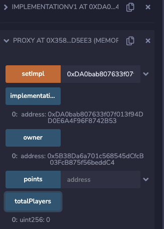

接下来，需要通过代理合约来调用逻辑合约的addPlayer或setPlayer了，看上去没有接口，这个怎么操作呢？有个小技巧，可以在remix环境先调用逻辑合约的addPlayer函数，例如将0xAb8483F64d9C6d1EcF9b849Ae677dD3315835cb2地址的分数设为100，具体操作如下图所示。虽然调用因为管理员权限问题会导致失败，但是却可以通过这样的手段拿到input数据，这个input实际上也就是合约调用的消息：msg.data。

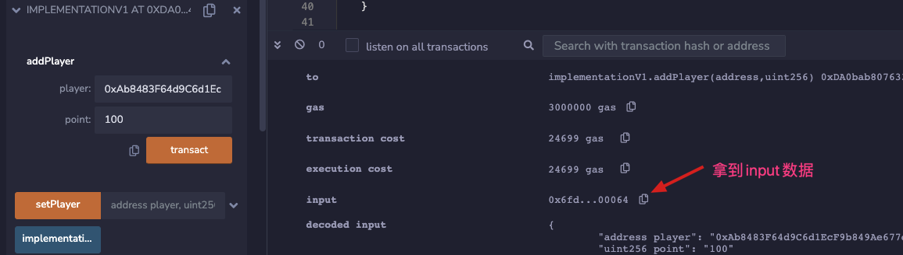

复制拿到的数据可以得到这样的结果：0x6fd075fc000000000000000000000000ab8483f64d9c6d1ecf9b849ae677dd3315835cb20000000000000000000000000000000000000000000000000000000000000064

把这个数据做一下切割，可以得到一些信息，0x6fd075fc代表函数签名（addPlayer），ab8483f64d9c6d1ecf9b849ae677dd3315835cb2则是我们传递的第一个地址类型参数，最后结尾的64则是100的十进制表示。所以，msg.data也就是将参数放在一起形成的编码数据。我们可以把这个编码数据通过“Low level interactions”的方式完成调用，如下图所示。

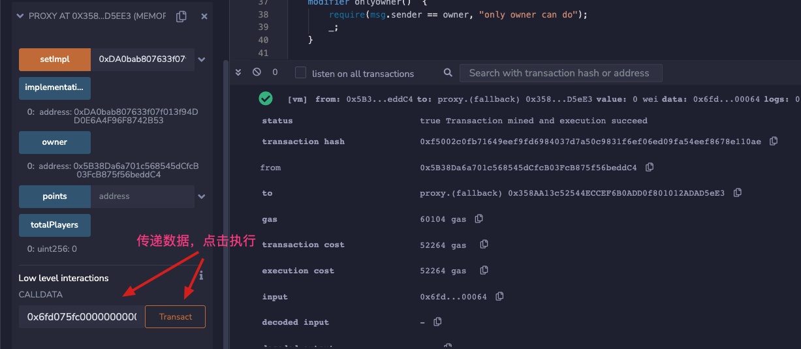

注意调用时要切换到之前部署合约的账户，否则管理员检测无法通过。此后，可以检查0xAb8483F64d9C6d1EcF9b849Ae677dD3315835cb2账户的分数变化情况，以及玩家数量的变化情况。如下图所示，玩家数量没有变化，分数变成了100。

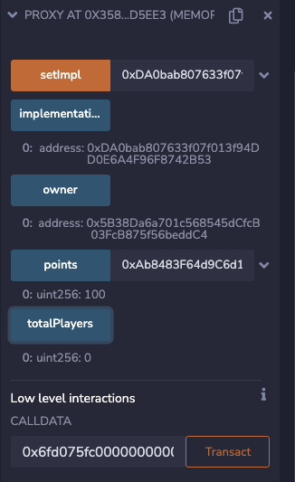

逻辑存在bug，所以需要升级一下。添加新的逻辑合约v2，它不需要完全重写，可以继承v1版本，然后重写部分功能就行了。

```js
//第二版本逻辑合约
contract implementationV2 is implementationV1 {
    
    function addPlayer(address player, uint256 point) override public onlyowner virtual {
        require(points[player] == 0, "player already exists");
        points[player] = point;
        totalPlayers ++;
    }
}
```

再次部署v2版本的逻辑合约，并将代理合约的逻辑合约实现更换为v2版本的合约，具体操作方法同上。接下来，组装一个新的calldata数据：0x6fd075fc0000000000000000000000005b38da6a701c568545dcfcb03fcb875f56beddc40000000000000000000000000000000000000000000000000000000000000063。

这个数据的含义是将0x5b38da6a701c568545dcfcb03fcb875f56beddc4的分数设置为99。通过“Low level interactions”的方式完成调用，再次检查totalPlayers和points的情况，就可以发现数据变得正常了，如下图所示。逻辑合约顺利完成了从v1到v2的切换，代理合约的地址是没有发生变化的。

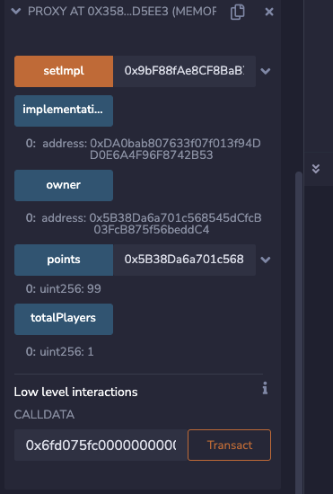


## 4. 总结

Solidity是一个极容易上手的开发语言，有经验的开发者可能3～7天就可以顺利入门，并编写一些合约代码。但是，Solidity毕竟是运行在区块链系统内的智能合约，它和区块链的一些原理和特点是有着强烈关联的，例如循环执行次数是有限制的，合约执行和账户权限往往都有关联等。

开发者在学习智能合约开发时，在掌握了基础语法后，可以阅读一些源码库，比如微众银行提供的智能合约案例库，还比如一些开源项目的合约文件，这对编写高质量的合约开发者是一个通用的进阶路径。