# Solidity 

***★知识要点★***

- 合约的编译、部署、测试
- 合约的数据类型
- 状态变量
- 函数与函数修饰符
- 数组和mapping
- 自定义结构
- 事务控制
- storage与memory的使用


## 1. 初识Solidity

智能合约的概念最早由*尼克·萨博*在1994年提出，受当时的计算机技术发展限制，智能合约只能停留在概念阶段。2013年，以太坊创始人Vitalik Buterin受比特币脚本启发，在以太坊白皮书中提出了智能合约的实现方式。为了编写智能合约，以太坊又专门设计了一门名为Solidity的编程语言，可以说它是第一款真正意义上的智能合约编程语言。接下来，我们将会简单了解一下Solidity，包括开发环境的说明，以及智能合约版“hello world”的实践。

###  1.1 开发环境说明

为了支持智能合约的运行，以太坊提供了EVM（Ether Virtual Machine，以太坊虚拟机），使用特定的Solc编译器可以将智能合约代码编译为EVM机器码，这些机器码可以在EVM中运行。如下图所示。

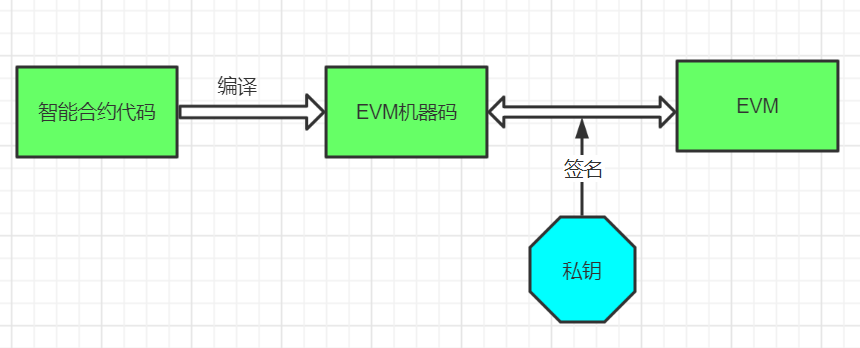

上面简单的介绍了智能合约的运行过程，通过这些介绍，我们可以得出一个结论，Solidity智能合约若想运行，需要有Solc编译器和EVM，EVM依赖于区块链节点，只要是支持EVM的区块链系统都可以作为开发节点使用，例如FISCO-BCOS或Geth；至于编译器的问题，建议使用内嵌编译器的在线IDE环境，例如WeBase-Front（微众银行提供的FISCO-BCOS节点前置服务）或Remix。这两款IDE都内嵌了EOA（以太坊外部账户），方便对智能合约的执行进行签名。
两个IDE的安装地址：
【[WeBase-Front安装使用教程](https://webasedoc.readthedocs.io/zh_CN/latest/docs/WeBASE-Install/developer.html)】

【[Remix在线IDE](http://remix.ethereum.org/)】

如果单纯学习Solidity开发，可能使用Remix也就够了，因为它内部也内嵌了EVM虚拟机，可以模拟智能合约的运行。如果要学习应用开发，则启动一个节点是有必要的。为了简化操作，下面的演示代码将使用Remix作为演示环境。

### 1.2 第一个智能合约 

通过前面的开发环境介绍，我们对智能合约有了一个基本的印象。如果把区块链比作数据库的话，智能合约类似于运行在数据库上的SQL语句，因此也可以把Solidity当作一种类似于与区块链交互的编程语言。下面，正式认识一下Solidity。

Solidity 是一门面向对象的、为实现智能合约而创建的高级编程语言。这门语言受到了 C++，Python 和 Javascript 等语言的影响，设计的目的是能在以太坊虚拟机（EVM）上运行。还需要明确的是，Solidity 是静态类型语言，支持继承、库和复杂的用户定义类型等特性。

另外，在以太坊黄皮书中，也特意强调了Solidity是一门图灵完备的编程语言，图灵完备属于专业术语，简单理解就是支持循环和条件分支处理。因此，Solidity语言当中肯定可以使用循环和条件判断语句的，关于Solidity的语法特性，我们将在后面的内容展开。接下来，让我们来看看入门Solidity的智能合约。

下面的代码中，第一行的作用是为了控制智能合约编译器的版本，pragma就是Solidity的编译控制指令，`^0.6.10`代表的含义是可以使用0.6.x的版本对该代码进行编译，也就是说0.5.x或0.7.x的编译器版本不允许编译该智能合约，符号“^”代表向上兼容。也可以使用类似`pragma solidity >0.4.99 <0.6.0;`这样的写法来表达对编译器版本的限制，这样看上去也是非常的简单明了！

> 本教程中将以0.6.10作为基础版本介绍Solidity智能合约开发。

contract是一个关键字，用来定义合约名字，它很像是某些语言里的定义了一个类（class）。hello是本合约的名字，这个合约的主要功能是向区块链系统中存储一个Msg字符串。constructor是该合约的构造函数，它必须是public的（在Solc编译0.8.x版本后，constructor将不再允许声明为），当合约部署时，执行的也就是构造函数的逻辑，该构造函数的功能就是将Msg初始化为“hello”。

```solidity
pragma solidity^0.6.10;

contract hello {
    string public Msg;
    constructor() public {
        Msg = "hello world";
    }
}
```

下面，我们尝试在Remix环境部署该合约，并测试运行效果。打开[Remix在线IDE](http://remix.ethereum.org/)，我们将会看到如下的效果。

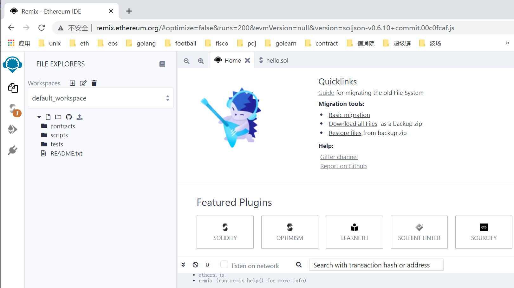

这其中，左侧的【】按钮是文件浏览器视图，【】按钮是编译器视图，【】按钮是运行环境视图。

接下来，我们演示部署hello合约的操作流程。首先点击【】按钮，打开浏览器视图，在contracts目录位置点击【右键】，在下拉表单中选择【New File】选项。

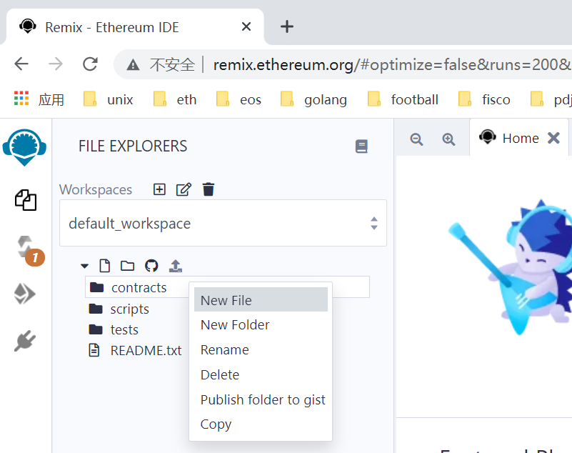

在输入框内容，输入智能合约文件的名字：hello.sol，如下图所示，然后回车创建文件成功。

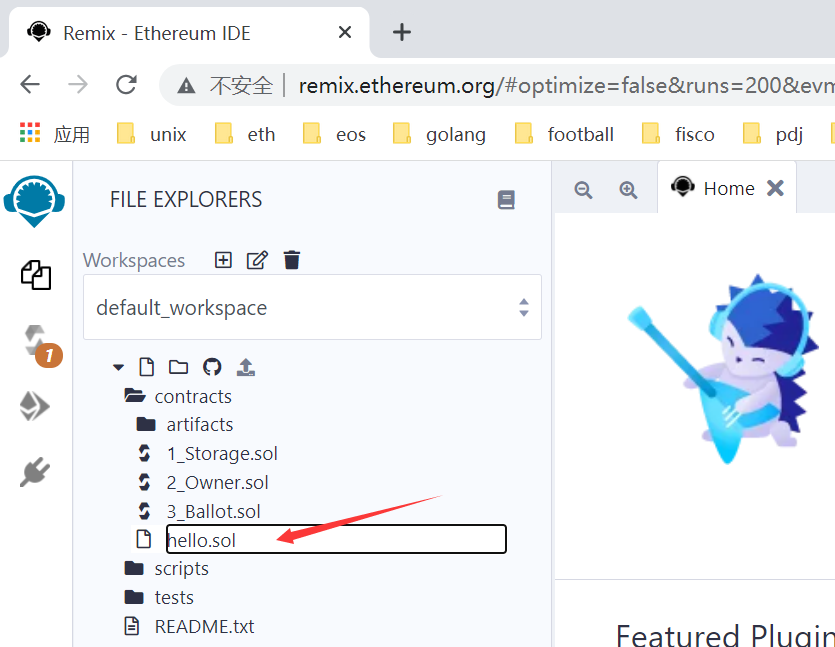


将之前的演示代码，粘贴到hello.sol文件中，并保存代码（Windows使用【ctrl+S】按键，macOS使用【command+S】按键），如下图所示。

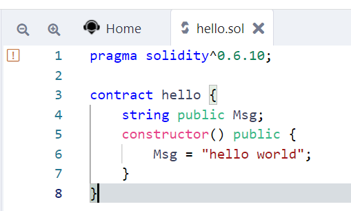

若要切换编译器，可以点击【】按钮，在COMPLIER下面的下拉表中选择对应的编译器版本，如下图所示。

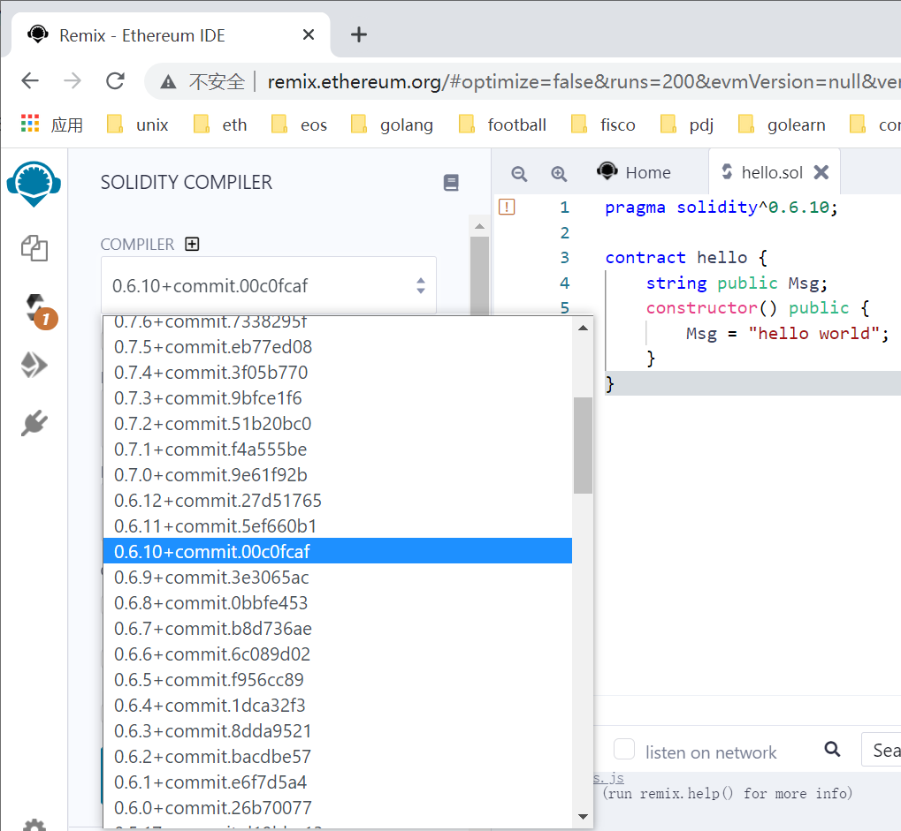

也可以在EVM版本位置选择某个特定版本，如下图所示。

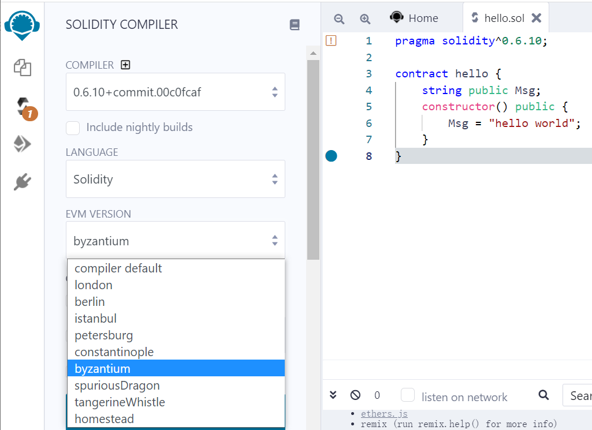

默认情况后，保存代码后会自动编译，代码没有语法错误的话，就可以尝试运行了。点击【】按钮，可以切换到运行视图。如下图所示，点击【Deploy】按钮，便可以部署该合约。

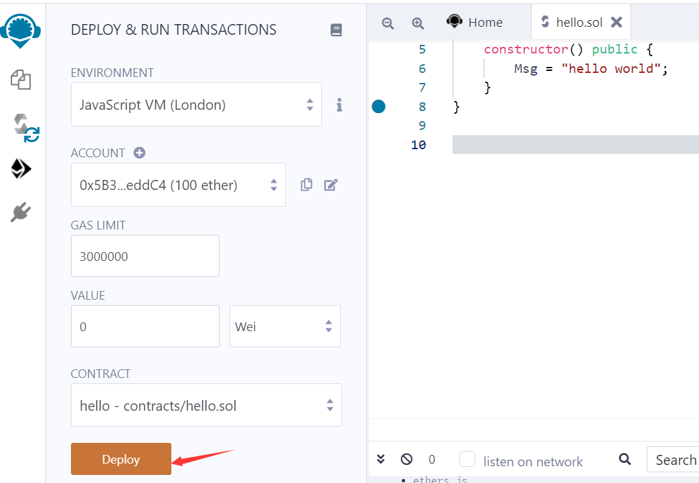

部署后，可以在下面的页面看到两部分信息，一个是合约对象，一个是运行信息，如下图所示。

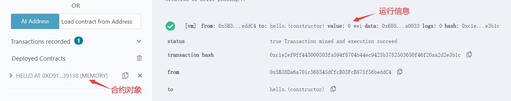

点击合约对象前的【】按钮，可以展开合约对象，如下图所示。之后，点击【Msg】按钮，可以看到hello world这个字符串内容。

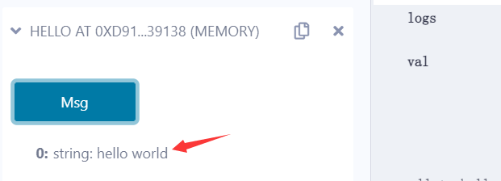

这就是智能合约部署到测试的全部流程，不要认为这仅仅是一次字符串的打印，这背后其实涉及到了复杂的区块链技术，客户端将字节码签名后发送给节点，全网共识后，节点EVM中运行该字节码，记录下这样的字符串。

## 2. 基础语法

之前，我们介绍了一个hello智能合约的部署和测试，接下来，我们着重介绍智能合约的语法。

### 2.1 数据类型

Solidity的数据类型非常丰富，下面我们通过一个表格介绍一下。

| 类型   | 描述   | 示例                                       |
| ------ | ---------- | ----------------------- |
| string | 字符串     | "fisco-bcos","abc"      |
| bool   | 布尔值     | true或false             |
| uint   | 无符号整数，256位，等价于uint256 | 20000000，1000000                          |
| int | 有符号整数，256位，等价于int256 | -1001，200 |
| byte | 字节类型，1个字节 | 0x1a，0x22 |
| bytes | 字节数组 | 0xa1a2a3,0xa1b2c3d4 |
| address | 地址类型 | 0x5B38Da6a701c568545dCfcB03FcB875f56beddC4 |

除了上表中所提到的数据类型，Solidity实际上也对整数类型和字节数组类型有着精确化的定义，比如uint8，uint16，uint24……uint256，int8，int16，int24……int256，bytes1，bytes2，bytes3……bytes32，从这样的定义看出，整数和字节类型每1个字节就会定义一种数据类型，这是因为在区块链系统存储数据成本是高昂的，类型定义越精确越好。

在上述类型，address类型是一种特殊的存在，它是Solidity语法中特有的数据类型，这涉及到EVM的账户模型设计。EVM中设计了2类账户，分别是外部账户和合约账户，外部账户就是我们调用合约或发起交易时的普通账户，合约账户则是代表合约部署后，也会获得和普通账户一样的账户地址。所以，无论外部账户还是合约账户，它们对外的呈现形式都是address类型。


### 2.2 状态变量与临时变量

熟悉面向对象编程的朋友会发现，contract定义的方式很像某些语言中的class，我们同样也可以在contract中定义类似于class中的成员变量，只不过在智能合约中，我们把它称其为状态变量。一旦被定义为状态变量，它也将被永久的存储在区块链上。除了状态变量，Solidity当中也可以在函数中使用临时变量，临时变量不会被存储在区块链中。

状态变量的定义语法为：

```solidity
Type [modifier] identifier；
```

Type为数据类型，identifier为变量名称，[modifier]是修饰符，可以使用public、private等来修饰该状态变量，代表该状态变量的访问权限，public类型的变量系统会直接为其提供同名的查询函数。此外，修饰符位置如果使用constant，则代表定义的是一个常量，在合约整个生命周期内不会发生变化。

临时变量的定义方式与状态变量类似，二者主要的区别是临时变量出现在函数内部，可以没有修饰符，也可以使用memory或storage，我们将在2.10小节详细介绍memory和storage的区别。

下面的合约代码，列举了一些定义变量的方式。

```solidity
pragma solidity^0.6.10;

contract hello {
	// 状态变量定义
    string public Msg;
    uint private age;
    // 常量定义
    bytes4 constant fid =  0xfa913621;
    constructor() public {
        Msg = "hello world";
    }

    function getDoubleAge() public view returns (uint) {
        // 临时变量定义
        uint dage = age * 2;
        return dage;
    }
}
```


### 2.3 block对象和msg对象

由于solidity是运行在区块链系统中，因此也会具备一些区块链特有的数据对象或函数。这类对象或函数无需开发者声明，可以直接在程序使用，一般我们会把这类对象称为内建对象或内建函数。

在Solidity当中，我们常用的两个内建对象是block和msg。block就是区块对象，我们可以了解一下其内部包含的数据和函数。

block对象结构：

- block.coinbase (address): 当前块的矿工的地址
- block.difficulty (uint):当前块的难度系数
- block.gaslimit (uint):当前块gas的上限
- block.number (uint):当前块编号
- block.blockhash (function(uint) returns (bytes32)):函数，返回指定块的哈希值，已经被内建函数blockhash所代替
- block.timestamp (uint):当前块的时间戳

msg对象代表调用合约时传递的消息内容，我们可以看一下其对应的结构。

- msg.data (bytes):完整的calldata
- msg.gas (uint):剩余的gas量
- msg.sender (address):消息的发送方(调用者)
- msg.sig (bytes4):calldata的前四个字节(即函数标识符)
- msg.value (uint):联盟链中无需使用此数据

msg.sender是非常重要的一个数据内容，它代表合约的调用者，会随着合约调用者身份的切换而改变。另外一个和调用者身份有关系的是tx对象下的origin，tx.origin始终代表最原始的调用者。当一个外部账户直接调用合约A时，合约A内看到的msg.sender和tx.origin没有区别，但若外部账户调用A合约，A合约又调用B合约时，此时B合约内看到的msg.sender是A合约的地址，tx.origin还是原来那个外部账户。如下图所示。

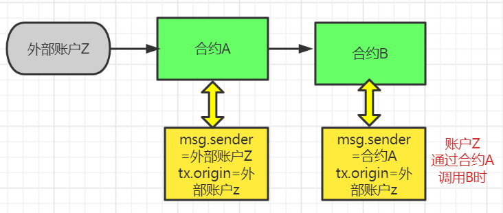


### 2.4 函数和函数修饰符

我们在智能合约开发时，实际上也是先将业务拆分，形成一个又一个的独立功能，之后将功能与函数相对应。与我们传统编程不同的是，在智能合约开发时没有主函数入口这样的从上到下的流程逻辑。如果把智能合约理解为一个进程的话，我们开发的函数是为了提供与该进程交互的接口。下面，我们来介绍一下Solidity的函数。其定义语法如下：

```solidity
function func_name(paramlist...) modifiers returns (returnlist...)
```

我们来逐项介绍一下函数的声明部分：

- function 是函数声明的关键字
- func_name 自定义函数名称，与我们习惯的函数命名规范没有区别
- paramlist 参数列表，可以0或多个参数，格式是：参数类型 参数名称
- modifiers 函数的修饰符，非常关键，我们后面要详细讨论
- returns 返回值关键字，看到s应该能想到可以同时返回多个值
- returnlist 返回值类型列表

下面，我们写一个函数来练练手，求1+2+...+100，返回uint256类型的结果。通过这个例子，我们也可以顺便掌握Solidity中循环的写法。下面的代码分别介绍了for循环和while循环的写法。

```solidity
contract func_demo {
	// for循环的写法
    function getSum() public view returns(uint256) {
        uint256 sum = 0;
      	//for循环
        for(uint256 i = 1; i<= 100; i ++) {
            sum += i; //累加求和
        }
        return sum;
    }
    // while循环的写法
    function getSum2() public view returns(uint256) {
        uint256 sum = 1;
        uint256 i = 0;
      	//for循环
        while(i<= 100) {
            sum += i; //累加求和
            i ++;
        }
        return sum;
    }
}
```

部署该合约，可以看到合约执行的结果是正确的。如下图所示。

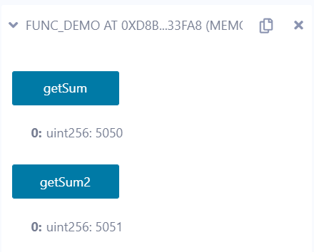

相信大家对Solidity语言已经有一定的感觉了，但是对于一点仍然还有很大的困惑，那就是函数的修饰符有时候会加view，有时又不加，部署后有的函数颜色是红色，有的颜色又是蓝色。现在，我们来解惑，着重介绍函数修饰符。

在Solidity代码中，针对权限访问的有如下修饰符：

- public	最大的访问权限，子类可以继承、可以访问，当前类能访问
- private  仅限内部访问，子类不能继承、不能访问
- internal  子类可以继承、可以访问，当前类可以访问
- external  子类可以继承、可以访问，当前类不能访问

针对状态变量的访问，也存在两类权限（资产转移类联盟链不存在），不同颜色的函数代表着不同的访问权限：

- view 对状态变量只读，这里的状态变量还包含区块链的内建对象数据、时间戳等
- pure 既不修改，也不读取状态变量的值

如果函数不加pure或view，则代表会修改状态变量的值，此时在Remix环境看到该函数的颜色为橘黄色，加了pure或view的函数蓝色为蓝色。


下面的例子显示了不同状态变量访问权限的函数。

```solidity
contract func_demo3 {
    uint256  count;
    // 修改状态变量
    function setCount(uint256 _count) external {
        count = _count;
    }
    // 仅读取状态变量
    function getCount() public view returns(uint256) {
        return count;
    }
}
```

部署该合约后，将会看到两种不同颜色函数，如下图所示。

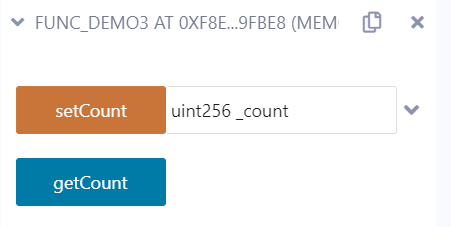


### 2.5 数组

智能合约可以使用动态数组或定长数组，不管是哪类数组都有一个length元素返回数组的长度，对于定长数组返回定义时的长度，动态数组返回填充元素最大下标+1，有了这个长度可以对数组进行遍历。对于动态数组可以使用push存入元素，定长数组是不允许的。下面的代码是一个动态数组使用的示例。

```solidity
contract array_demo {
	// 定长数组
    string[5] public names;
    // 动态数组
    uint256[] public ages;
    constructor() public {
        names[0] = "yekai";
        //names.push("fuhongxue");//不允许的操作
        ages.push(10);
    }
    // 返回值为：5，1
    function getLength() public view returns(uint256, uint256) {
        return (names.length,ages.length);
    }
}
```

部署后，测试该合约，我们将会看到如下的结果。

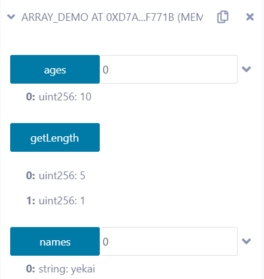

从上述代码可以看出，数组的访问可以通过从0开始的下标进行。

针对动态数组，我们也可以使用pop方法删除其最后一个元素。


### 2.6 mapping

介绍完数组，再来说说映射表，映射表其实也就是其他语言中的map。它将key-val成对存储，通过key可以快速的定位某个value。下面我们举个例子，将address和姓名按照map存储，并访问。

```solidity
contract map_demo {
    mapping(address=>string) addr_names;
    constructor() public {
    	// 修改mapping内数据
        addr_names[msg.sender] = "yekai";
    }
    
    function setNames(string memory _name) public {
    	// 修改mapping内数据
        addr_names[msg.sender] = _name;
    }
    
    function getName(address _who) public view returns (string memory) {
    	// 读取mapping内数据
        return addr_names[_who];
    }
}
```

部署该合约，如下图所示。我们可以在【getName】按钮旁输入框内输入地址：0x5B38Da6a701c568545dCfcB03FcB875f56beddC4，而后点击【getName】按钮就可以看到mapping内存放的该地址对应的数值。

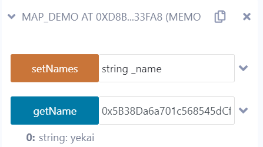

账户地址，可以在ACCOUNT下拉表中获取，如下图所示。

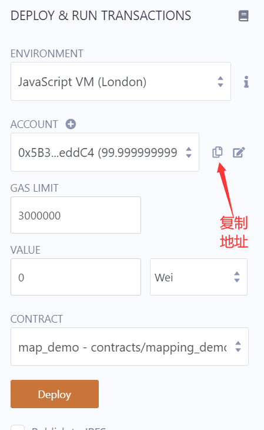

我们也可以切换其它账户来调用合约的setNames方法，例如将账户地址切换为：0xAb8483F64d9C6d1EcF9b849Ae677dD3315835cb2，之后在【setNames】按钮旁输入框内输入一个字符串，并点击【setNames】按钮运行设置名字的方法，之后可以再把地址复制到【getName】按钮旁输入框内，查看之前设置的名字，运行效果如下图所示。

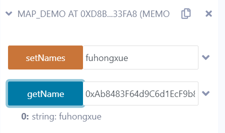


### 2.7 自定义结构

单纯的原生数据类型并不能很好的支持一个复杂事物的定义，例如描述一个人，可能要包含姓名，年龄，性别等信息，单纯用string或uint这样的数据类型是不足够的。编程语言往往会为开发者提供自定义结构的方式来解决该类问题，Solidity也是如此。例如我们想定义一个User结构，它的定义方式如下。

```solidity
struct User {
    string name;
    uint8  age;
    string sex;
}
```

Solidity较早版本需要将该结构声明在contract之内，0.6.x版本编译器开始，struct结构可以在contract之外定义。下面的代码是关于自定义结构的使用示例。

```solidity
pragma solidity^0.6.10;
pragma experimental ABIEncoderV2;

struct User {
    string name;
    uint8  age;
    string sex;
}

contract struct_demo {
    User user;
    
    function setUser(string memory _name, uint8 _age, string memory _sex) public {
        user.name = _name;
        user.age  = _age;
        user.sex = _sex;
    }
    
    function getUser() public view returns (User memory) {
        return user;
    }
}
```

代码中`pragma experimental ABIEncoderV2;`的作用是用来返回结构化的数据对象，在0.6.x版本编译器时需要加上此句话，最新的0.8.x版本的编译器已经无需此句声明。


### 2.8 事务控制与异常处理

在编写程序时都要面对处理异常的情况，如果仅仅是处理异常不算什么，关键是涉及到了状态变量值的变化。试想，我们在做银行转账业务时，账户A向账户B转账100元，银行在做交易时，需要执行两个动作：

```sh
账户A = 账户A - 100
账户B = 账户B + 100
```

如果第一个动作执行成功，第二个动作执行失败，就会出现很尴尬的事情。对于这类业务，传统的解决方案都是加入事务控制。也就是说，利用事务的特性，两个操作要么一起成功，要么一起失败。

在Solidity中也存在类似的机制，我们可以在执行过程中判断某个条件是否成立，如果不成立，则通过revert()函数退回到合约执行之前的状态，相当于还原现场。

Solidity中，也直接为开发者提供了require和assert函数。

```solidity
require(bool cond_expr, string msg);
assert(bool cond_expr);
```

require和assert在内部调用了revert函数，例如下面的语句是等价的。

```solidity
if(a != 10) {
	revert();
}
# 等价于
assert(a == 10);
# 等价于
require(a == 10, "a not equal ten.");
```

assert多用于检测程序的bug，require多用于检测合约的执行条件。当assert或require的条件不被满足时，本次合约的调用将会被退回到初始状态，就像是数据库事务里执行了rollback操作。


### 2.9 自定义修饰符

在了解了require和assert的能力后，相信大家脑海中会想象在智能合约的函数中编写各种条件断言的情形，有的时候我们会在多个函数内书写相同的判断逻辑。这虽然没什么，但重复工作量较多，也会影响代码可读性。

Solidity为开发者提供了自定义修饰符的方法，开发者可以自定义函数修饰符，并把断言判断放在自定义修饰符中。下面是一个自定义修饰符的例子。

```solidity
modifier onlyadmin() {
        require(msg.sender == admin, "only admin can do");
        require(amount > 100, "amount must > 100");
        _;
    }
```

modifier是自定义修饰符的关键字，onlyadmin是自定义修饰符的名称，可以设有参数，也可以没有参数。在其内部可以编写想要检测的逻辑条件。"_;"千万不能省略，它是一个占位符号，标志着自定义修饰符的结束。

一旦某个函数使用了onlyadmin这个自定义修饰符，它就会把onlyadmin中所有的检测条件都先执行一遍。下面是一个自定义修饰符使用的示例合约。在setCount函数里使用了onlyadmin，它会检测两个条件通过后再执行其内部的逻辑。

```solidity
contract modifier_demo {
    address public admin;
    uint256 public amount;
    
    constructor() {
        admin = msg.sender;
        amount = 101;
    }
    
    modifier onlyadmin() {
        require(msg.sender == admin, "only admin can do");
        require(amount > 100, "amount must > 100");
        _;
    }
    
    function setCount(uint256 _amount) public onlyadmin {
        amount = _amount;
    }
}
```


### 2.10 storage与memory

相信大家在写函数的时候，编译器经常会提示有些变量要加memory或calldata，有时候临时变量又会提示要加memory或storage。

在函数参数或返回值声明时，如果返回数据的类型是变长的，那么需要加memory修饰，例如string、bytes、数组、自定义结构等类型都需要使用memory。

在临时变量声明时，对于变长的数据类型也要在storage或memory之间二选一。storage的作用类似于C++中的引用传递，用storage修饰的变量等同于右值的一个分身，对其进行修改也会影响到本尊。memory修饰的临时变量相当于右值的一个拷贝，对其进行的修改不会影响到本尊。例如下面合约提供了两个修改年龄的函数setAge1和setAge2。

```solidity
struct User {
    string name;
    uint8  age;
    string sex;
}

contract storage_demo {
    User adminuser;
    
    function setUser(string memory _name, uint8 _age, string memory _sex) public {
        adminuser.name = _name;
        adminuser.age  = _age;
        adminuser.sex = _sex;
    }
    
    function getUser() public view returns (User memory) {
        return adminuser;
    }
    // 值传递方式修改
    function setAge1(uint8 _age) public {
        User memory user = adminuser;
        user.age = _age;
    }
    // 引用传递方式修改
    function setAge2(uint8 _age) public {
        User storage user = adminuser;
        user.age = _age;
    }
    
    function setAge3(User storage _user, uint8 _age) internal {
        _user.age = _age;
    }
    
    function callsetAge3(uint8 _age) public {
        setAge3(adminuser, _age);
    }
}
```

经过之前的分析，可以预见setAge1修改年龄不会成功，setAge2则会修改成功。

另外，storage也可以用来修饰函数参数，也是代表引用传递的含义，不过这样的函数只能用于内部函数，智能合约不太可能去修改外部用户输入的数据。

例如下面的例子，setAge3是另一个修改用户年龄的方法，它可以通过callsetAge3被调用，由于其对adminuser是引用传递的方式，因此也可以修改成功。

```solidity
function setAge3(User storage _user, uint8 _age) internal {
	_user.age = _age;
}

function callsetAge3(uint8 _age) public {
	setAge3(adminuser, _age);
}
```


### 2.11 小实践

编写一个判断两个字符串是否相等的函数。

经过分析，该函数不会读取和修改状态变量，并且希望被外部访问，因此使用的修饰符应该是public和pure。声明函数原型如下

```solidity
function isEqual(string memory a, string memory b) public pure returns (bool)
```

大家可能会想到，直接return a == b;似乎就完成代码了。实际上肯定是不行的，因为Solidity是不支持两个字符串直接比较的。

一个简单的思路是将string类型转换为bytes类型，它实际上是一个字节数组，每一个字节是可以直接比较，因此只要所有的字节都能相等，就代表两个字符串相等。实现代码如下。

```solidity
contract equal_demo {

    function isEqual(string memory a, string memory b) public pure returns (bool) {
        bytes memory aa = bytes(a);
        bytes memory bb = bytes(b);
        // 如果长度不等，直接返回
        if (aa.length != bb.length) return false;
        // 按位比较
        for(uint i = 0; i < aa.length; i ++) {
            if(aa[i] != bb[i]) return false;
        }

        return true;
    }
}
```

除了这种方式，其实也可以借助Solidity内置的哈希函数来解决问题，当然，这里有一个前提，哈希函数必须是防碰撞的。哈希函数的碰撞确实存在，但这种存在只是理论上的可能，我们是没办法做到碰撞的。

如果哈希函数防碰撞是成立的，那么接下来的逻辑就简单了，将两个字符串分别求哈希值，如果两个哈希值相等，那么也可以认为反过来两个字符串是相等的。由于哈希值实际上也是整数值，因此可以使用“==”直接判断是否相等。

在这里，要用到Solidity提供的哈希函数keccak256，它的返回值是一个bytes32类型的哈希值，它的输入参数只有一个，而且必须是经过内建函数abi.encode编码后的结果，abi.encode是一个编码函数，它对输入参数的个数和类型没有限制。

因此，下面的实现方式也可以判断两个字符串是否相等。

```solidity
function isEqual(string memory a, string memory b) private pure returns (bool) {
        bytes32 hashA = keccak256(abi.encode(a));
        bytes32 hashB = keccak256(abi.encode(b));
        return hashA == hashB;
    } 
```

### 2.12 总结

Solidity是一个专为EVM虚拟机运行而设计的高级语言，它是一个静态型的、面向对象的语言。它的风格与Javascript类似，虽然编写智能合约与普通程序设计类似，但毕竟它是运行在区块链平台，因此有其自身的编程特性。另外，智能合约往往会与用户资产相关，因此编写时应比普通程序设计还要加倍小心。


